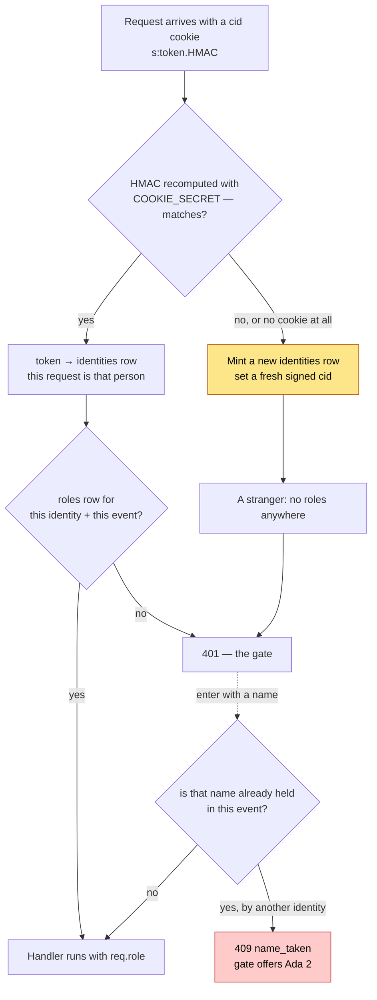
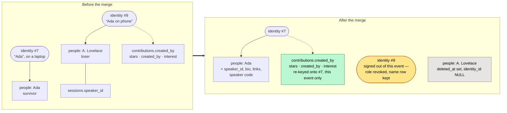

# Architecture

How LibreSesh is put together, and — just as important — what it deliberately
does not do. If you are changing something load-bearing, read the
[Security](#security) section first; several choices that look like gaps are
deliberate, and a few that look harmless are not.

## The shape of it

```
Caddy (:443, automatic HTTPS)
  └── reverse_proxy localhost:3000
        └── one Node process
              ├── Express      API + SSE + static web/dist
              └── better-sqlite3 → $DATABASE_PATH (single file, WAL)
```

One process. One file. No database server, no broker, no queue, no cache. The
whole point is that a conference organiser can run this on a 1 vCPU VPS and back
it up with `cp`.

**Exactly one process may own the database file.** SQLite permits multiple
writers with WAL, but the SSE broker is in-process memory — a second instance
would serve stale schedules to half the room. Never scale the `app` service past
one replica.

## Request path

```
cookie/identity → rate limit → role check → handler → audit + SSE broadcast
```

`server/src/app.ts` wires this in order and the order matters:

- **Identity first**, so even a rejected request is attributable in the audit log.
- **Rate limit before role check**, so password guessing is throttled before it
  can be evaluated.
- **`loadEvent` before `requireRole`**, because a role is per event.
- **`eventAuthRoutes` before `requireRole`** — earning a role has to come before
  requiring one, or the password gate would demand the password it grants.
- **`calendarRoutes` before `requireRole`** — a subscribing calendar app has no
  cookie and authenticates by capability token instead (see below).
- **`/me/link` is global, not event-scoped** — redeeming a link phrase swaps
  the identity cookie itself, so it hangs off `meRoutes` right after the
  identity middleware, before any event exists in the request.

Handlers are synchronous. `better-sqlite3` and `bcryptjs` are both sync, so
Express 4 propagates thrown errors without an async wrapper. `HttpError`
subclasses carry the status and a machine-readable `code`; `errorHandler` shapes
every failure as `{ error: { code, message } }`.

## Data model

| Table | Notes |
| --- | --- |
| `events` | Three bcrypt password hashes, timezone, day viewport, archive flag |
| `event_slugs` | Every slug an event has been renamed away from; `getEventBySlug` falls back to it, so old links keep resolving |
| `identities` | Anonymous cookie token, the display-name seed, optional iCal token |
| `link_codes` | Hashed phrases that adopt an identity: device phrases (single-use, 10 minutes) and admin-minted speaker codes (per person, live until revoked) |
| `event_identities` | `(event, identity) → display name`, unique within the event |
| `roles` | `(identity, event) → viewer\|user\|speaker\|admin` |
| `rooms`, `tags` | Per event, soft-deleted |
| `session_formats` | What kind of thing a session is — talk, workshop, panel. A name and a colour, nothing else. Per event, soft-deleted, in the organiser's running order rather than by name. A session wears one (`sessions.format_id`, nullable); deleting a format clears it from them (migrations 014, 015) |
| `breaks` | Lunch and friends: a label and local minutes of day, `date` null meaning every day. No room, no author, hard-deleted |
| `sessions` | Scheduled: always has a room and a time; `blocks_open_booking` holds the floor against attendees |
| `proposals` | Pitched: no room, no time, until an organiser places it |
| `people` | One per identity that has entered the event (made at the gate, migration 010), plus organiser-typed shells nobody has claimed yet. Holds the full name; the username lives on `event_identities`. `archived_at` files a row out of the lists without deleting it (migration 013). Manage → People lists these and nothing else |
| `contributions` | Notes, links, questions; `hidden` for moderation |
| `stars`, `proposal_interest` | Private per-identity interest |
| `audit` | Append-only log of every write |

Times are stored as **UTC ISO-8601 strings**. Every rule that a human would
express in local time — the five-minute snap, the day viewport, the event date
range — is evaluated in the event's IANA timezone via `Intl` in
`server/src/shared/time.ts`. There is no timezone library. Offsets that are not
whole hours (Kathmandu is UTC+05:45) and DST transitions are covered by tests;
do not "simplify" this by comparing UTC minutes.

**Soft deletes everywhere.** `deleted_at` rather than `DELETE`, so an organiser
can undo vandalism (`/trash` and the restore endpoints). A hard delete of a
session would orphan its contributions and stars.

**The slug is an address, not a key.** Nothing in the database references an
event by slug — every other table joins on `event_id`, and a role is stored
against `event_id` too — so renaming an event moves exactly one string and
costs nobody their place: an organiser stays an organiser, a starred agenda
stays starred, because none of that was ever attached to the name. What a
rename *would* break is the links already handed out, which is what
`event_slugs` is for: the slug being left behind keeps resolving in
`getEventBySlug`, so the invite URL on a badge, a subscribed calendar feed and
an API caller written against the old name all still answer. The web app
notices `event.slug` differs from the one in its URL and replaces the address
bar; that is cosmetic, and nothing server-side depends on it happening.
Uniqueness is checked across both tables (`slugTaken`), so a slug that still
redirects cannot be handed to a new event.

### A format is not a type

`sessions.type` is `official | open` and answers **who put this here**: the
published programme, or an attendee booking a room that allows it. The stored
values are unchanged, but nothing shows the word "open" to a reader any more —
it read as *open to join*, which every session on the schedule is, so the badge
meant to mark the exception described the rule. The session form says
**Official** and **Non-official**.

The grid and the list mark neither by default. `events.show_official_badge`
(migration 016, off) turns on a small **Official** on blocks and cards, for the
event that actually mixes a published programme with an open floor. Marking the
programme rather than the exception is the way round that survives both ends:
an event where everything is official has nothing to say, and an unconference
has nothing to say either. The session's own panel always says which it is. It decides
permissions — who may move the session, whether it can hold the floor — and it
is the oldest column in the table.

`sessions.format_id` answers **what this is**: a talk, a workshop, a panel, a
jam. It decides nothing. No rule reads it, no placement check consults it, and
a session without one is in the state every session in the app was in before
migration 014. The two are independent: an open session can be a workshop and
an official one can be a jam.

They are two columns and not one because they are two questions, and the app
had a word for only the first of them. The visible label on the official/open
control in the session form is therefore **Placement**, not Type — the field at
the top of that form is the one that says what kind of session it is, and two
fields called Type at opposite ends of one form would be indistinguishable.

Formats are event-defined rather than an enum because an unconference invents
them; `shared/formats.ts` ships a dozen suggestions the organiser clicks to
create, and creates none of them on its own. The shape is exactly the tags
table: a name and a colour.

**A format carries no length.** Migration 014 gave it one, which the session
form prefilled, and migration 015 took it away again — it made one field answer
two questions, the same mistake "type" made. A workshop is a workshop at ninety
minutes or at a whole afternoon, and picking a format to *describe* a session
should not silently retime it. How long a session runs is the session's, bounded
by `shared/sessionLimits.ts`: five minutes to a day, in five-minute steps.

### Who may change a session

Three questions, deliberately separate, and the bug they caused when they were
conflated is worth keeping in view:

1. **May this person change this session at all?** `assertMayMutate`. An
   organiser always may. Anyone **credited on the session** may — that is the
   whole test, independent of role, because the speaker role is minted by a
   code an organiser has to remember to send and most speakers never hold one.
   Otherwise it takes the `session.edit_own` capability, authorship, and an
   open session.
2. **May they move it?** Only an organiser, for an official session. Checked on
   what actually *changed* — room, type, start, end — never on which keys the
   request carried, because the session form posts the whole session on every
   save and a presence check reads an untouched field as a move.
3. **May they delete it?** The creator and the organisers. `assertMayMutate` is
   called without `speaksHere` on the delete route: being credited on a session
   is a claim on its words, not a mandate to take it off the programme.

Editing is **not** gated on `session.create_open`. Creating and editing are
different permissions, and an event that closes the first — a curated
conference — must not close the second on its own speakers.

### Sessions that hold the floor

`sessions.blocks_open_booking` marks a session as the only thing happening:
while it runs, the `user` role may place nothing anywhere in the event.
`assertNotBlocked` in `sessionRules.ts` is the whole rule, and it is applied on
every path an attendee can reach — create, and the retime half of PATCH.

Three decisions in it are easy to get wrong later:

- **It is per session, not per type.** `type = 'official'` means only "an
  organiser created it", and at a real unconference that covers registration,
  the coffee break and a track that runs all afternoon. A rule that fired on
  "an official session is happening" would close the grid for the entire event
  rather than protect the keynote, and the organiser who switched it on would
  have no way to see why.
- **It is event-wide, so the room is not a parameter.** The point of a plenary
  is that there is nowhere else to be; a hold that only covered the bookable
  rooms would be a hold on nothing, since those are the only rooms an attendee
  can reach anyway.
- **It refuses placement, never existence.** A session already booked in the
  hour stays where it is when the mark goes on, and its owner can still edit
  it — PATCH re-checks only when the window actually moves. Refusing a title
  fix would punish an attendee for a decision the organiser made afterwards.
  Such sessions, and anything a speaker or organiser places against a hold, are
  badged *competing* by `competingIds` in `Calendar.tsx`; the badge is a
  property of the overlap, computed on the client from the day's sessions,
  which is why it is not on the DTO.

Speakers pass the rule (`atLeast(role, 'speaker')`). A speaker with a talk to
give is part of the programme, not someone it is being protected from.

### Breaks

Lunch, dinner, the coffee break live in their own `breaks` table, not on
`sessions`. The first attempt made them a session flag (`sessions.background`,
migration 003, removed in 004) and that was the wrong shape: a break has no
speaker, no tags, no description, no contributions and no author, nobody
attends it *instead of* something else, and it is not in a room. What a break
actually is: a label, a span of the local clock, and the day it belongs to.

- **Local minutes of day, not instants.** `start_min`/`end_min` are minutes
  since midnight in the event's timezone. That is what lets one row mean "12:00
  every day", which is how a printed schedule says it — and what keeps lunch at
  noon across a clock change, which a per-day instant could not.
- **`date IS NULL` means every day**, and is the common case. A date pins the
  row to that one day, which is how "dinner on the Wednesday" is said. That is
  the whole of "customisable per day": there is no exception list, because a
  break that does not apply on one day is two rows or a shorter event.
- **It is drawn, and only drawn.** The band is `aria-hidden` and
  `pointer-events-none`; nothing opens it, and there is no detail view to open.
  It exists so the schedule reads honestly and nobody books over lunch by
  accident. It stops nothing — an attendee may run a session straight through
  it, which is the whole difference between a break and a session that holds
  the floor.
- **Hard delete, no soft delete.** Nothing references a break and it holds
  nobody's writing, so there is no hole to restore and the trash has nothing to
  offer. Rooms and tracks are soft-deleted precisely because sessions point at
  them.
- **Organisers only, and edited in one place**: Manage Event → Programme →
  Breaks. It is deliberately not in the session form, because a break is not a
  session anyone is composing.

Migration 004 carries nothing over. A session that held the old flag stays
exactly where it is and reverts to being an ordinary session, rather than being
guessed into a break: the flag's rows are instants, and turning one back into
"12:00 every day" needs a timezone SQLite does not have.

### Track hours

A track can state the hours it accepts sessions in — "workshops run in the
mornings" — and migration 005 gives it two columns (`tracks.start_min`,
`tracks.end_min`) plus a `track_windows` table for days that differ. Both
columns null is the default and means the track takes a session at any hour,
which is what every track did before the feature existed.

- **Local minutes of day, like breaks and unlike sessions.** "Mornings" is a
  wall-clock claim; storing instants would break it at a clock change. The pair
  is written together and never half-set — the schema refuses one end without
  the other, because a rule with one bound is a rule the enforcement cannot
  read.
- **A day in `track_windows` replaces the window, it does not narrow it.**
  "Workshops run 09:00–13:00, except the Saturday, when they have the
  afternoon" is one row. An override that could only ever cut a day shorter
  could not say that sentence, and a unique index on `(track_id, date)` keeps a
  date from saying two things.
- **It binds `user` and `speaker`; admins pass.** This is one notch stricter
  than the blocking-session rule, which lets speakers through. Running against
  a plenary is a judgement call about the programme; a track's hours are what
  the strand *is*, so a talk outside them is on the wrong strand rather than an
  awkward one. Organisers keep the grid as their instrument and place the
  exceptions.
- **Setting the hours moves nothing.** Narrowing a window leaves every session
  already on the track exactly where it is, unbadged: the window is a rule
  about what may be booked next, not an instruction to reshuffle a programme
  that already exists. The PATCH route re-checks only a placement that actually
  changes — retimed, or moved onto a different track — so the owner of a
  session that predates the window can still fix a typo in it.
- **A deleted track drops its overrides**, and a revived one states its hours
  afresh. They are read only through their track, so an orphan row would be
  invisible and would surprise whoever revived the name.

The resolution itself — which window applies on which day — lives in
`server/src/shared/trackHours.ts` so the client draws the hours from the same
function the server refuses by. A grid that disagreed with the rule about which
day is which would be worse than showing nothing.

### One database, many events

Every event lives in the same SQLite file, scoped by `event_id`. The obvious
alternative — a database per event — was considered and rejected, because
identity here is deliberately *cross-event*: one signed cookie is one person
across the whole instance, `GET /me` answers with their role in every event,
and the event list is a query. Splitting per event would not remove that shared
state, it would relocate it into a registry database, and then everything that
spans events — the event list, cloning an event's rooms and tags into a new
one, `/trash`, backups, migrations — would have to straddle two connections.

What per-event databases would genuinely buy is isolation, and the isolation
that actually mattered was over names (below), which a schema change bought
outright. Revisit this only if a single instance ever hosts events large or
sensitive enough that physical separation is the requirement — at which point
the answer is probably separate *instances*, not separate files.

### Why a display name belongs to the event, not the identity

A name is how one person is known inside one room. Two unconferences a year
apart have no business fighting over "Ada", so `event_identities` holds the
name and enforces `UNIQUE(event_id, display_name)`. `identities.display_name`
is only a trace: empty when an identity is minted, following whatever name
its owner last chose, prefilled nowhere. A username is typed at every first
gate — nothing like `attendee_x7f2k` is generated — and a device re-entering
an event gets its own name back from `GET /e/:slug/gate`.

**Two names, two jobs.** The **username** (`event_identities.display_name`)
is what the room calls you: unique here, on everything you post, in the
header chip. The **full name** (`people.name`) is what a session is credited
to: free to repeat, since two "Alex Chen"s can be in one room and the merge
tool exists for two rows that are one human, not for namesakes. Every
identity that enters holds exactly one live `people` row (`ensureOwnProfile`
in `server/src/people.ts`, called from the gate; migration 010 backfilled the
entrants from before), with the full name initialised to the username and not
following it afterwards. A `people` row *without* an identity is a shell an
organiser typed onto a talk for someone who has not arrived. When somebody
enters under that shell's name the gate does not hand it over silently — the
same name can be a different person — but answers `profile_exists` and takes
it only on a second entry with `claimProfile`.

Global uniqueness was the tempting one-line version — a `UNIQUE` index and a
check in `PATCH /me` — and it is worse than the bug it fixes. It makes the
first person to type a name the owner of it across every event on the instance
forever, including identities nobody uses any more, and it means entering an
event where your name is taken forces you to rename yourself in every *other*
event too.

Two consequences worth knowing:

- **The name is claimed at the gate, before the role is granted.** A clash has
  to leave you outside the event with a name to change, not inside it nameless.
  See `claimEventName` in `server/src/eventIdentity.ts`.
- **It is its own table, not a column on `roles`.** Signing out of an event
  deletes the `roles` row; that must not hand your name to someone else or
  strip the authorship from everything you already posted. `NameResolver` takes
  an event id and resolves against it, so a session's credit follows the name
  its author uses *there*.

### Why proposals are a separate table

A pitch has no room and no time; a session always has both. Making
`sessions.room_id` and `starts_at` nullable would mean either a table rebuild
(SQLite cannot relax `NOT NULL` in place) or placeholder values that every query
then has to special-case. Placing a pitch creates a real session and links the
two, leaving ownership with the pitcher.

### What a cookie is, exactly

Identity is the one concept everything else hangs off, and it is easy to be
vague about. Precisely, then:

**The cookie is `cid`, and it carries the token — the token *is* the identity.**
`identities.token` is 22 random base62 characters and is stored in the database
in clear. Whoever presents it is that person; there is no second factor and no
account. It is a bearer credential, which is why the row is treated as a secret
everywhere else in this document.

**`COOKIE_SECRET` signs that cookie; it does not encrypt it.** Express sets the
cookie's wire value to

```
s:<token>.<base64 of HMAC-SHA256(token) keyed by COOKIE_SECRET, "=" stripped>
```

so the token is plainly readable in the browser's cookie jar, followed by a
signature over it. On each request `cookie-parser` recomputes the HMAC with the
configured secret and compares. The signature answers *"did this server issue
this value"* — it stops someone editing their own cookie to a token they
guessed or stole from a URL — and answers nothing about confidentiality. The
cookie is `httpOnly`, `SameSite=Lax`, `secure` in production, 400 days.

**The UID is the identity's public face; the token stays secret.** Each
`identities` row also carries `public_id` — 5 random hex characters, unique on
the instance — shown as `UID: A3F9C` to you in the profile menu and to admins
in the audit log and rosters. It is random, not sequential, so a UID reveals
nothing about how many identities exist and cannot be enumerated; and it is
*only* a name, never a credential — presenting a UID proves nothing. Row ids
(`identities.id`) never leave the server.

**When the check fails, the request is simply anonymous.** `cookie-parser` puts
`false` (not `undefined`) in `req.signedCookies.cid` for a bad signature, and
`identityMiddleware` treats anything falsy as "no cookie" and mints a fresh
identity. Do not tighten that test to `!== undefined`.

**So changing `COOKIE_SECRET` signs out every visitor at once**, and the damage
does not stop there: their display name is held, uniquely per event, by the
identity they just lost, so they cannot even re-enter under their own name.
That is why an unconfigured secret is generated **once** and kept in
`.cookie-secret` beside the database rather than invented per boot, why
production requires an explicit one, and why the gate offers "Enter as *Ada 2*"
when a name is already taken. `config.cookieSecretOrigin` records which of the
three routes was taken — `env`, `file`, or `ephemeral` — and the boot log warns
loudly about the last one.



Rotating the secret pushes every returning visitor down the yellow branch at
once, and their old names are still held — which is the red box, for everyone,
until they pick a new one.

**If the secret leaks, on its own, very little happens.** It lets someone forge
a valid signature over a token of their choosing — but the token still has to
exist in `identities`, and tokens are 22 random base62 characters. A forged
cookie carrying a token nobody holds resolves to no identity, and the
middleware mints a fresh anonymous one, which is exactly what the forger would
have got by sending no cookie at all. The token is the credential; the secret
only proves a token was issued here.

**Where it does matter is in combination.** Someone holding tokens — from a
copied database file, a whole-instance backup, a careless `SELECT` in a
screenshot — cannot turn them into working cookies without the secret. So the
two halves are worth keeping apart: **do not store `COOKIE_SECRET` on the
volume that holds the database or its backups.** In production it is an
environment variable for exactly this reason. (The dev fallback writes
`.cookie-secret` beside the database, putting both halves in one place — which
is fine precisely because a dev database holds nothing worth stealing, and is
why the fallback is not offered in production.)

**What identity is not:** it is not a login, and it is not global state. A role
is a row keyed on (identity, event); a display name is a row keyed on (event,
identity). Signing out of an event deletes the role, never the identity — which
is what lets authorship survive it.

### Invite QR codes, and why the password rides in the fragment

An organiser can turn one of the three event passwords into a QR code — Manage
Event → Settings → Invite by QR — for a badge, a poster or a sheet of paper at
the door. The code encodes

```
https://schedule.example.org/e/democonf#k=<password>&r=<role>
```

and the choice of `#` over `?` is the whole design.

- **A fragment is never sent to the server.** It stays in the browser, so the
  password appears in no access log, no `Referer` header and nothing a reverse
  proxy in front of the app writes down. A query string would put an event's
  password into Caddy's log once per scan.
- **It is taken out of the address bar before anything renders.**
  `takeInvite()` runs in `main.tsx`, reads the hash once and calls
  `history.replaceState`, leaving a bare `/e/:slug`; the gate then reads that
  one copy rather than the URL. Deliberately at startup and not inside the
  gate, because the gate does not always appear — an organiser who scans the
  attendee code already holds a role and walks straight through to the
  schedule, and would otherwise be left with the password sitting in their
  address bar with nothing to clear it. `replaceState` and not `pushState`, so
  Back does not return to a URL carrying the secret and the browser's history
  list never holds one. The consequence is the one people actually want: an
  attendee who scans the poster and then pastes "the link" into a group chat
  has shared a page that *asks* for the password, not one that hands it out.
- **`r` is a caption, never a grant.** The role in the fragment only decides
  what the gate says — "Invited as Attendee" — before anything is submitted.
  Entry is still `POST /auth` with the password, and the server derives the role
  from the password as it always did. A forged `r` produces a wrong label on a
  screen and nothing else, which is why it is not signed.
- **Scanning is not entry.** The gate still asks for a display name, because
  names are unique per event and claimed at entry (§Why a display name belongs
  to the event). Entering everyone automatically under whatever seed their
  device happened to mint would fill the roster with strangers nobody can
  identify — the QR saves the password, not the introduction.

What this deliberately does *not* do is make the code itself a secret. Anyone
who photographs the poster holds that password until it is changed, exactly as
if it were printed underneath — an event password is a shared secret read off a
wall, and this only saves the typing. A revocable per-invite token would be a
different feature with its own table; the QR is the password, made scannable.

So the panel says so, in front of the code rather than in a document nobody
opens, and it says a different thing per role. The warning is loud for the two
passwords that grant *writing* — an attendee code lets a stranger into the
programme, an organiser code hands over the entire event including the other
passwords — and quiet for the viewer one, whose leak costs a stranger reading a
schedule. That asymmetry is the point: a box that shouted at every organiser
who printed any code would teach them to stop reading it, and then it would not
be there for the organiser code, which is the one that matters.

The panel that draws it lives in `web/src/pages/AdminInvite.tsx`, and two
things about it follow from the storage model rather than from taste:

- **The organiser has to type the password.** `events` holds bcrypt hashes and
  nothing else, so the server cannot produce a plaintext to encode, for an
  admin or for anyone.
- **So the server confirms the typing instead.** `POST /e/:slug/password-role`
  is admin-only, rate-limited on the same bucket as the gate, and answers with
  the role a password grants without granting it. It exists because a QR is
  printed once and scanned by everyone, and a typo in it is not discovered
  until two hundred people are standing at the door. It is deliberately not
  `POST /auth`, for the same reason `/confirm-admin` is not: that route upserts
  a role, so an organiser encoding the *viewer* password would silently demote
  themselves out of the page they were standing on. Minting is audited
  (`invite_qr`) — "who printed the organiser code, and when" is exactly what
  the log is for, and a printed code outlives the session that made it.

The address the code points at is remembered per browser and editable, because
`window.location.origin` is only sometimes right: behind Caddy it is the public
hostname, but in a dev container the app is reached through a forwarded port
and on a laptop wired to a projector it can be a LAN address no phone can
resolve. There is no server-side `PUBLIC_BASE_URL`; the organiser can see the
address they are about to print, which is the check that matters.

QR encoding is `qrcode-generator` (MIT, zero dependencies, pinned), rendered as
inline SVG in `web/src/components/QrCode.tsx` — one `<path>` for the whole
symbol rather than a rect per module, since it re-renders on every keystroke in
the password box. It is black on white in both themes on purpose: the thing
gets printed, and a dark-mode inversion is something many phone cameras will
not read.

### One person, many devices

A browser identity lives in one cookie jar, so the same human on a phone and a
laptop would be two strangers. The fix is **adoption, not merging**: a link
phrase resolves to an identity, and redeeming it sets that identity's token as
the redeemer's cookie. Both devices are then literally the same `identities`
row, so role, stars, profile and authorship follow with zero migration of data
— there is nothing to reconcile because nothing was ever split.

Two kinds of phrase share the `link_codes` table and the one redemption
endpoint:

| | Device phrase | Speaker code |
| --- | --- | --- |
| Minted by | anyone, from the menu behind their name | organisers, from a person's profile page |
| Shape | three words (~27 bits) | four words (~37 bits) |
| Lifetime | 10 minutes, single use | until revoked, reusable |
| Bound to | the minting identity | a `people` row (`person_id` set) |

All the identity work for a speaker code happens at **mint** time — an
unclaimed person gets a fresh identity, the speaker role, and its display name
claimed — precisely so that redemption stays the same dumb token adoption in
both cases. That is what makes one speaker code work from any number of
devices. Phrases are stored hashed; guesses share the password rate-limit
budget.

### Archiving a profile, and why it is not deleting

A `people` row has three states, not two: live, archived (`archived_at` set),
and soft-deleted (`deleted_at` set). The middle one exists because deleting is
the wrong tool for the profiles that actually accumulate at a real event — the
ones made while testing the room, a shell typed twice, a walk-in who never came
back. Deleting cannot be undone, it strips the name off every session the
profile was credited on, and `DELETE /people/:id` refuses outright for anyone
who *holds* their profile, which is exactly the case an organiser most wants
tidied away.

Archiving changes nothing but visibility. The row keeps its sessions, its bio,
its role, its speaker code and its identity. What it loses is its place in the
lists an organiser reads: every segment of Manage → People except **Archived**
drops it, and the speaker picker stops offering it. Crediting by name still
finds it — `resolveSpeaker` orders live profiles first and falls through to an
archived one rather than spawning a twin — because a name that matches only an
archived profile is still that person.

**The holder is the way back out.** `DELETE /people/:id/archive` takes
`requireRole('user')` rather than `admin`, and then allows it for an organiser
*or* for whoever holds the row. That is deliberate and it is the whole
difference from deletion: an organiser tidying up at the end of a day cannot
tell a profile that is finished with from one whose person is coming back
tomorrow, and the person themselves can. They still hold their cookie and their
role, so they open their profile, see that it was put away, and take it back
out. `archivedAt` is therefore on the public `PersonDto` and not among the
organiser-only facts — the one reader who most needs it is the holder, and it
discloses nothing about who runs the event.

Both directions are idempotent and both are audited (`archive`, `unarchive`).
Archiving twice does not re-stamp the date: *when* it was filed is what tells a
tidy-up from a mistake three weeks later.

### Merging two people

Two rows in `people` can describe one human — an organiser typed "Ada
Lovelace" onto a session while Ada herself claimed a profile as "A. Lovelace".
`POST /people/:id/merge` folds them together. The names in the code are
positional, and worth stating once: **the `:id` in the URL is the survivor**,
the profile that remains; **`from` in the body is the loser**, the duplicate
being folded in and soft-deleted.

A merge moves *everything*, in two layers (the second decided 2026-08-31):
profile data first, then — when both profiles were claimed by different
identities — the loser identity's whole body of work in this event.



So after a merge:

- the survivor holds both profiles' sessions and pitches, the identity claim if
  it had none, the bio and links if its own were empty, and the speaker code if
  that code still names the surviving person;
- **the loser identity's work in this event moves to the survivor's identity**
  (`rekeyIdentityWork`): stars, contributions, proposal interest, and the
  authorship of sessions and pitches. Where both did the same thing — starred
  one session, marked interest in one pitch — the duplicate collapses to one,
  because the primary key is (identity, thing) and one person does a thing
  once;
- **the losing device is signed out of the event** — its role revoked, the
  same operation as /logout — rather than left signed in as a zombie that is
  present but owns nothing. Deleting the identity itself would not be safe:
  it may be a real person at other events on this instance, and the audit log
  points at it. Its event display name row stays, so the People list and
  old audit entries keep their label and the name stays reserved. The device
  can re-enter through the gate and is then a fresh participant;
- the re-keying and the sign-out are **scoped to the event being merged**. The
  losing identity may be a genuinely different presence at other events on the
  instance; those are untouched. Unifying the history means the losing device
  no longer owns anything it wrote here, which is why merge is admin-only,
  irreversible (no `/trash` path), and audited.

An admin merging the wrong two people is therefore a real mistake with no undo
— the confirmation step in the UI is the only gate. The audit log keeps the
truthful record either way: rows written before the merge keep the actor who
actually wrote them.

**What becomes of the losing device (the identity #9 scenario).** Merge
unifies the event's *records*; it cannot unify the human's *devices*, because
it cannot reach into another browser's cookie jar. So after Ada's laptop
(identity #7) survives a merge, her phone still holds identity #9 — signed out
of this event, but the same #9 everywhere, since an identity belongs to the
device, not to an event (§What a cookie is, exactly). Entering an event never
mints an identity; only a first-ever visit from a cookie-less browser does.
From here the phone can go two ways:

- **The right way: device linking.** Ada opens "Link another device" on the
  laptop and types the phrase on the phone. The phone's cookie is repointed to
  #7; both devices are now one identity, and #9 goes quiet forever — its row
  stays, because the audit log points at it and its UID must keep resolving.
- **The wrong way, which nothing currently prevents: re-entering.** If the
  phone just passes the gate again, it comes back as #9 — same UID as before,
  fresh role, none of its old work — and the human is split across two
  identities again, undoing the organiser's cleanup. The gate does not yet
  hint "if this is you, link this device instead"; that gap is queued in
  STATUS.md.

The same fork applies to anyone signed out by a merge who was *not* a
duplicate — a genuinely different person mistakenly merged simply re-enters
and is themselves again, minus the work that moved. That, too, is why merge is
admin-only and confirmed.

### The audit log, and what "append-only" means here

Every write appends a row: identity, event, action, entity, entity id, time.
Nothing in the app updates or deletes one — there is no edit path, for
organisers either — and `GET /e/:slug/audit` reads it back into Manage Event →
Audit, keyset-paged because the log only ever grows at the head.

It is bounded, though, and the distinction matters. `events.audit_keep`
(migration 016, default 1000, 0 for unlimited) caps how many rows an event
keeps; past that the oldest are dropped, checked once every hundred writes
rather than on each one. So the log is append-only in the sense that nobody can
rewrite history, and *not* in the sense that history is kept forever: an
organiser who sets a low cap and then makes a great many edits can push an
earlier action off the end. The alternative was unbounded growth on an instance
meant to run for years, and the trade is stated in the UI rather than buried.

Rows with no `event_id` — a whole-database backup, an event created from the
landing page — belong to the instance rather than any event. They are never
pruned by an event's cap, and no screen shows them yet.

### Importing a schedule, and why it is not the export read backwards

`POST /api/events/import` (`server/src/importEvent.ts`) creates an event with
its rooms, tracks, tags and sessions from one JSON document. The obvious design
would have been to accept what `GET /e/:slug/export.json` produces, and it is
the wrong one. An export is a record of a database: numeric ids, UTC instants,
authorship names belonging to identities the reader has never seen. An import
is a description of a schedule, and the thing being described is almost never
another LibreSesh instance — it is a printed programme, a conference website, a
photograph of a wall. So the document has room names where the export has room
ids, and the wall-clock times that are printed on the schedule where the export
has instants; the event's own timezone is what turns one into the other.

Three consequences worth knowing:

- **Names are the only handle, so they are checked hard.** Rooms, tracks and
  tags are declared once each and referred to by name (matched case- and
  whitespace-insensitively, because transcription is not consistent). A session
  naming an undeclared room is refused rather than quietly creating it: an
  invented column is far harder to notice in a grid than an error naming the
  row, and a document that is run twice should fail the same way both times.
- **One transaction.** A document that fails on its last session leaves no
  half-built event, which is what makes "fix the file and run it again" a
  complete recovery story. `dryRun` uses the same path and rolls back at the
  end, so a rehearsal exercises every check a real import would.
- **Errors and warnings are different things.** A session outside the event's
  own declared dates is a contradiction inside one document and is refused. A
  session outside the *day viewport* is not — it is in the database and off the
  top of the grid, which reads as a failed import, so it comes back as a
  warning naming the row and pointing at Settings. Double bookings warn too:
  admins are allowed them, and the grid badges them.
- **A repeat expands; the link is opt-in on top.** A repeat says "every day
  until the 20th", or "mon, wed, fri, except the 7th", and it becomes one
  ordinary session per day *before* anything is written. By default there is no
  series id and nothing downstream that knows a repeat existed: this schedule is
  last-write-wins rows that anyone with the role can drag, retitle or delete.
  The old worry was that a series entity would have to answer "does moving
  Tuesday move all of them?" on the first edit — and for an event whose sessions
  drift, the answer is "no" nearly every time. **Linked sessions answer it the
  other way round rather than reversing it:** an edit's default reach stays
  *this row only*, propagation is opt-in per edit and carries content but *never*
  time, so moving Tuesday still never moves the rest. See §Linked sessions
  below. A repeat is also a claim about the *printed clock*, so each day is
  resolved through the event timezone separately: that is what keeps 14:00 at
  14:00 across a clock change, and why the import form of it refuses
  `startsAt`/`endsAt`.

  There are two front doors and one rule. `server/src/shared/repeat.ts` holds
  the calendar — which days a run lands on, and what makes a run
  self-contradictory — and lives in `shared/` so the session form can count a
  run before submitting it and count it the way the server will.
  `server/src/repeat.ts` adds the zod schema and turns a refusal into a 400.
  On top of that sit `planSessions` in `importEvent.ts` (a `repeat` key on a
  document row) and `POST /sessions/repeat` (the **Repeat** control in the
  session form). Anyone who may place a single open session may place a run of
  them — the attendee running morning yoga every day, not organisers alone —
  and a non-organiser's run is held per occurrence to exactly the rules a single
  open session is (open room, inside the event window, no clash, not under a
  hold). An organiser's run may be official and hold the floor. A run that one
  front door refuses is refused by the other, because there is only one thing to
  refuse it.

An export *is* read back, but not as a second format: `importDocument.ts`
recognises one (`exportedAt`, or the ids only an export has) and translates it
into the authoring document — ids to the names they stood for, minutes to
`HH:MM`, `null` to an absent key — before the schema ever sees it. The export
stays an archive keyed by ids, every export ever downloaded becomes importable,
and there is one importer to keep right. The translation says what it cannot
carry as the first warning: profiles, pitches, contributions and star counts
are a record of an event being used, which is not what an import builds. The
one decision it hands back is the slug — an export names the event it came
from, and the importer refuses a taken one like any other. The round trip is
pinned in `tests/importExport.test.ts`: export, import, export, compare.

### Linked sessions

`sessions.series_id` (migration 017) is an opaque id shared by the members of a
series and **nothing else** — no series table, no foreign key. It is a *soft*
grouping: every member stays an independent, draggable, last-write-wins row, and
the id only powers an offer. `server/src/series.ts` holds the rules; the spec is
`_planning/specs/linked-sessions.md`.

- **Two ways to link.** `POST /sessions/repeat` with `link: true` stamps a run as
  it is created — the fast path for the morning-yoga case now that anyone who may
  place a session may repeat one (the form defaults the link on for
  non-organisers, off for organisers, whose runs are usually loose programme
  rows). `POST /sessions/link` links a chosen set that *already* exists: someone
  picks their same-titled sessions from `GET /sessions/:id/link-candidates`. Candidates
  share a *title key* (`seriesTitleKey`: trimmed, whitespace-collapsed, folded)
  and are the actor's to edit. `POST /sessions/unlink` drops one out, collapsing a
  series left with a single member.
- **The security invariant.** Linking and propagation grant **no edit right the
  actor did not already have.** `canMutate` is the boolean twin of
  `assertMayMutate`, kept in step with it; the candidate list is exactly the
  linkable set, link re-checks every id, and a propagated edit re-checks each
  target and *skips-and-reports* the ones it may not touch. So attendee vs
  organiser reach falls out of the existing per-session permission model — no new
  capability.
- **Propagation is content, never time.** `PATCH /sessions/:id` takes
  `applyTo: one | later | all` (default `one`). On a linked session the chosen
  scope re-applies the edit's content — title, description, speakers, room,
  track, format, type, tags, livestreams — to the siblings, each keeping its own
  `starts_at`/`ends_at`. Placement is re-validated at each sibling's *own* time,
  so a propagated room that clashes there is one of the skips. The response
  reports `applied`/`considered` for the "four of five" toast. Time-of-day
  propagation is a deliberate non-goal for now.

The document format itself is documented for the people writing one, in
`docs/schedule-import.md`; `docs/examples/schedule-import.example.json` is the
template, and the test suite dry-runs that exact file so it cannot drift from
the schema.

### Migrations

Numbered `.sql` files in `server/migrations/`, applied at boot, each in its own
transaction, tracked by filename in the `migrations` table.

`001_baseline.sql` is the whole schema in one file, squashed on 2026-08-31 from
the seventeen files that preceded it — before any instance held data, which is
the only moment a squash is free. Four of those existed only to backfill rows
or rebuild a table to widen a `CHECK`, and could never have run again. The
squash was verified rather than trusted: a database built by replaying all
seventeen and one built from the baseline were compared on what SQLite itself
reports — every column with its type, default, nullability and primary-key
position, every foreign key, every index with its uniqueness, partiality and
columns, and every `CHECK` — and they matched exactly. The old files are in git
history.

That window is now shut. Any database that recorded the old filenames will
refuse to start against this build, which is the runner's newer-build guard
doing its job, and the fix is to delete a development database rather than to
weaken the guard. From here it is the ordinary rule: never edit an applied
migration, add a numbered file. The runner matches on filename, so an edit
would silently never reach a database that already has that name — and nothing
would report the divergence.

The runner
(`server/src/db.ts`) enforces three rules that matter once instances run in
the wild:

- **It refuses to run downgraded.** A `migrations` row naming a file not on
  disk means the database belongs to a newer build; booting anyway would fail
  slowly and weirdly. Restore the pre-migration backup to roll back.
- **It snapshots before touching an established database.** `VACUUM INTO`
  `<db>.backup-<stamp>` whenever migrations are pending and at least one has
  ever been applied. Nothing prunes these (yet) — one per upgrade.
- **Rebuilds are supported and verified.** SQLite cannot widen a CHECK or drop
  a NOT NULL in place; the recipe is create-new → copy → drop → rename, which
  needs `foreign_keys` off (a pragma that cannot change mid-transaction, so
  the runner turns it off around the pending files). Every file must leave
  `PRAGMA foreign_key_check` clean or its transaction rolls back. The worked
  examples are in git history rather than on disk — the squashed 014 (adding
  the speaker role to two `CHECK`s) and 015 (making `link_codes.expires_at`
  nullable) — and `tests/migrationRunner.test.ts` exercises the same recipe on
  fixtures of its own.

Prefer additive migrations anyway — `ADD COLUMN … DEFAULT`, new tables,
overrides-only tables like `event_permissions` — and reach for a rebuild only
when the schema genuinely must change shape. `004_breaks.sql` is the one file
that takes something away: it adds the `breaks` table and drops
`sessions.background`, the column that used to stand for the same idea in the
wrong place. Dropping a column in place needs SQLite 3.35+, which the bundled
`better-sqlite3` is well past, and it carries no data across — the reasoning is
in §Breaks.

## Realtime

One SSE channel per event slug, held in a `Map<slug, Set<Response>>` in
`server/src/sse.ts`. Every write publishes the fresh entity; clients hold one
bundle and patch it by id, so replaying an event twice is harmless. On
reconnect the client refetches the whole bundle rather than replaying a missed
range — an entire event is one modest JSON payload, and this removes a whole
class of gap-detection bugs.

Heartbeat every 25s. Any proxy in front must keep idle timeouts above that or it
will cut streams; the shipped `Caddyfile` sets 300s.

Stars and proposal interest are **not** broadcast: they are private per
identity, and a broadcast would leak who is going to what.

## Frontend

Vite + React + Tailwind, no state library. `useEventData` holds the bundle in a
reducer and folds SSE changes into it. Two invariants live there: rooms stay
sorted by `sortOrder` (room order *is* the calendar's column order) and tags by
name, because `upsert` alone would silently break the ordering the server
established.

Filters live in the query string so a filtered view is a shareable link.

A session has two presentations and one component. `/e/:slug/s/:id` opens it as
a panel over the grid; `/e/:slug/s/:id/full` renders the same session as a
page. Both routes mount `SchedulePage` — every handler the detail needs (star,
edit, delete, contribute, hide) is defined there, along with the SSE stream
that keeps it live, so a separate route component would have had to duplicate
all of it. What differs between the two is `SessionDetail`'s `layout` prop:
one stacked column against two, and a `collapseAt` of three against `null`.
The panel collapses each contribution kind to its three most recent so the
composer stays reachable; the page is where you go to read the rest, so it
collapses nothing. Keeping one component for both is what stops a new field or
a new permission rule landing in one presentation and not the other.

Markdown is rendered by escaping raw HTML **before** parsing
(`web/src/lib/markdown.ts`), not by sanitising after. Nothing an author writes
can produce markup. Link hrefs are additionally restricted to http/https/mailto.

### The component layer, and what is not a library component

Form controls come from **shadcn/ui on the Base UI engine** (`@base-ui/react`),
added file by file into `web/src/components/ui/` rather than as a dependency
with a component per import. Base UI owns what a hand-rolled control gets wrong
and keeps getting wrong: the focus trap and `inert` on a dialog, the styleable
popup a native `<select>` will never have, keyboard semantics on a listbox.
Raw `<select>`, `<input>` and `<textarea>` are ESLint errors outside this
directory and `ui.tsx`, which is what stops a new screen hand-rolling a field.

Three controls are deliberately **not** library components, and the reasons are
worth keeping because each looks like an oversight:

- **`Field`/`ControlShell`/`TextInput`** (`ui.tsx`). `Field` owns the id and
  passes it, `aria-describedby` and `aria-invalid` down through context, so a
  call site cannot leave a control unlabelled — it had at 95 of 96 call sites
  before. shadcn's `Input` is a styled `<input>` with none of that, and its
  `Form`/`FormField` are react-hook-form, while this app is controlled
  `useState`. Adopting them would trade working label association for sameness.
- **`SpeakerCombobox`.** Its value is *either* an existing person id *or* a
  newly typed name, gated by `onlySelf`/`isAdmin`/archived rules, with a
  create-a-person row. That maps badly onto an item/value model.
- **`NumberField`.** Digits-only input, range checked where it is typed, and
  "empty is not yet wrong". `type="number"` looks like it does this and does
  not — see `web/src/lib/numberField.ts`.

**Base UI is never on the first-paint path.** Routes are `React.lazy`, and
`Modal` sits in its own file (not `ui.tsx`) so importing a primitive cannot
drag the dialog runtime into the entry chunk — it did exactly that once, and
the entry went 62 → 83 kB gz. The entry is ~61 kB gz; Base UI rides the Modal
and Select chunks. `tests/modalPortal.test.ts` guards the split, because the
failure is invisible: everything still works, it just arrives late.

Two rules keep English out of places it could not later be pulled from:
`lib/errorText.ts` is the only place an API failure becomes a sentence (the
server sends a code plus details, never prose the client renders), and
`lib/plural.ts` picks a plural form via `Intl.PluralRules` instead of appending
an "s". Both are enforced by source-text tests. This is not i18n — there is no
translation layer and none is planned — it is keeping the option open.

### Where a failure goes

One rule, by what the person can do about it, and it is the rule the code has
followed since the forms overhaul rather than a new one:

- **A failure they can fix by changing what they typed renders where they
  typed it, with their text intact.** In a dialog that is `FormError` in the
  footer, beside the button they pressed — never at the top of a form they have
  scrolled away from. On a page it is `FieldError` under the control (the
  profile's field-at-a-time editors, the gate). The form stays open holding
  the message until the next attempt clears it.
- **A failure they cannot fix from the form goes to the toast:** the network,
  a row someone else changed first (`stale`), an unexpected status. A form
  cannot resolve those, so it must not hold them.

Both paths get their sentence from `errorText`; the split is only *where* it
lands. The one deliberate exception is the admin tab's add-rows (`InlineCreate`
and the room and break rows): a failed add is a toast even when it is the
person's own typo, because the open row has no line under it to put a message
on, the box keeps the text so the fix is a word away, and the row is used a
handful of times an event. The same class of failure must not be a toast in
one section and inline in another; if a new screen wants a third path, this is
the paragraph to change first.

## Security

### Threat model

This is a **public-ish, low-stakes, high-trust** system: a conference schedule
that a room full of strangers can edit. The assets worth protecting are the
integrity of the programme and the privacy of who is attending what. It is
explicitly *not* built to withstand a targeted attacker with time.

**In scope:**

| Threat | Mitigation |
| --- | --- |
| Guessing an event password | bcrypt (cost 10); 5 attempts per 15 min per identity **and** per IP, `Retry-After` on the 6th |
| Guessing a link phrase | Same 5-per-15-min budget as passwords; stored hashed. Device phrases are single-use and die in 10 minutes; speaker codes are four words (~37 bits) and revocable |
| Casual vandalism of the programme | Soft deletes + restore; `audit` log with actor UIDs, readable by admins at Manage Event → Audit; `hidden` flag for contributions |
| Spam / flooding | Token buckets per identity and per IP on every write class; server-enforced max lengths |
| XSS via session or profile text | HTML escaped before markdown parsing; URL scheme allowlist; no `dangerouslySetInnerHTML` on unescaped input |
| Open redirect | Every client navigation is prefixed with a literal `/e/` |
| Reading a schedule you were not given | Viewing requires the viewer password; there is no public event view |
| Leaking one person's agenda | Stars and interest are never broadcast and never attributed in any payload; only aggregate counts are exposed |
| A leaked calendar URL | The token grants only what its owner's role already allows, and only for that one event; revoking the role kills the feed |
| A leaked `COOKIE_SECRET` | Little on its own — a forged signature still needs a real 131-bit token, and an unknown one just mints an anonymous identity. Kept out of the database's volume so a copied DB and the secret do not leak together |
| A leaked whole-database backup | Never leaves the server unencrypted: AES-256-GCM under a scrypt key (N=2^15) from a passphrase typed at download time, gated by the instance password and the 5-per-15-min auth budget |

**Out of scope, accepted:**

- **Shared passwords cannot be revoked per person.** Anyone who learns the admin
  password is an admin until it is changed. Rotating it (admin settings) is the
  only remedy, and it does not evict existing role grants — those are rows in
  `roles`, deliberately, so a rotation does not sign the whole room out mid-event.
- **Identity is a cookie, not a person.** Clearing cookies makes you a new
  attendee. A device-link phrase carries one identity onto a second device, but
  that is continuity, not authentication: whoever types a live phrase becomes
  that person, role included. Impersonation by display name is trivial and not
  defended against. Do not build anything that treats a display name as an
  identity.
- **The database file is the room key.** `identities.token` and `ics_token`
  are stored in clear, so anyone who can read the SQLite file can become any
  attendee (link phrases are hashed only because they transit screens and
  shoulders, not because the DB is distrusted). Accepted deliberately: the
  instance host is trusted, full stop. If that ever stops being true, hash the
  tokens at rest (they are random, so a plain SHA-256 lookup works) rather
  than bolting auth onto the trust boundary.
- **No CSRF tokens.** Cookies are `SameSite=Lax`, which covers the cross-site
  form-post case for the state-changing verbs used here. Any future `GET` that
  mutates state would break that assumption.
- **A determined attacker with a valid password can ruin the schedule.** The
  audit log and restore endpoints are the recovery path, not prevention.

### Things that will bite you

- **`.npmrc` sets `ignore-scripts=true`.** `better-sqlite3` will not build on
  `npm install`. Use `npm run rebuild:native`, or `--ignore-scripts=false` in
  Docker. This is a supply-chain gate; do not remove it to "fix" the build.
- **`COOKIE_SECRET` must be set and stable in production.** Elsewhere an
  unconfigured one is generated once and kept in `.cookie-secret` beside the
  database, because a key that changes per boot invalidates every identity —
  and the failure is worse than it sounds: the visitor comes back a stranger
  *and* cannot reclaim their own display name, which the identity they lost
  still holds. If neither reading nor writing that file works, the boot log
  says the next restart will sign everyone out.
- **`TRUST_PROXY=1` behind a reverse proxy**, or every request appears to come
  from the proxy and the per-IP rate limit becomes a single shared bucket.
- **The instance password gates event creation** and the whole-database
  backup, and is compared in constant time. It is not a user account; it is a
  deploy-level secret.
- **A whole-database backup is a credential, not a document.** It is the file
  the point above calls the room key, so the download encrypts it and the UI
  says so in as many words. The per-event JSON export is the opposite by
  construction — `exportEvent` builds a shape that has nowhere to put a hash or
  a token, rather than filtering secrets out of DTOs, so a new secret column
  cannot leak into it by being added. That asymmetry is deliberate: one file is
  for sharing, the other is for a safe.
- **Rate limits are in-process memory.** They reset on restart and do not span
  instances — which is fine, because there is only ever one instance.

## Testing

Vitest against a temp SQLite file per suite. The suites that matter most are the
permission matrix (`sessions`, `contributions`, `people`, `proposals`), the
timezone maths (`time`), the rate limiter, and the SSE stream — which runs
against a real listening server over a real socket, because the interesting
failures are in framing and buffering, not in the broker's data structures.

`BCRYPT_COST=4` in test config: the algorithm under test is identical, and cost
10 turned a 5-second suite into 30.
