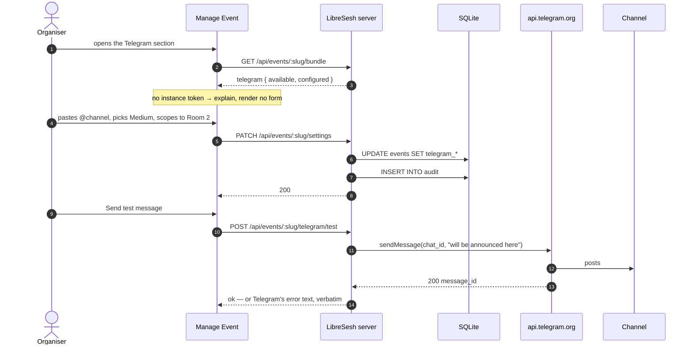
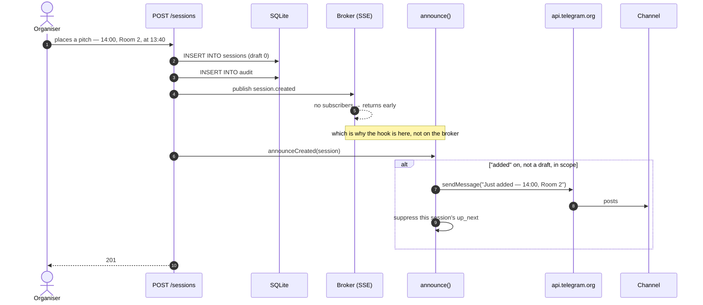

# Announcing the schedule to a Telegram channel

**Status:** designed 2026-09-15, not built. No branch yet. Reframed the same day
from a broadcast channel to a **group**, which changes how it is set up, adds
commands, and brings back an inbound path — see *Why a group changes the
design*.

## Why

The schedule is a website, and a website has to be visited. At an unconference
the grid changes all day — a pitch gets placed at 13:40 for 14:00, a room
swaps, someone cancels — and the people who need to know are in a corridor
holding a coffee, not refreshing a tab. The iCal feed covers the person
organised enough to subscribe in advance; nothing covers the room.

Most (un)conferences already run a Telegram group for exactly this and fill it
by hand. This is that job, done by the instance that already knows the answer.

The destination is a **group**, not a broadcast channel. That is a decision, not
an accident, and most of what follows depends on it.

## What a Telegram bot is, and is not

Worth stating plainly because every part of the design follows from it, and
because the intuition is usually wrong.

A bot is **not a program and not a place where code runs**. It is a row in
Telegram's database — a name, an avatar, and a token — and the token is a
credential that lets code elsewhere act as that account. Telegram offers no
scheduler, no timer, and no way to make a bot fetch a URL on an interval. There
is nothing to deploy to Telegram and nothing to configure there beyond creating
the bot and making it a channel admin.

So **all** of the logic below lives in the LibreSesh server process, beside the
identity sweep in `server/src/index.ts`. There is no second service. The
60-second loop reads SQLite directly — the announcer is in the same process as
the database, so it is a prepared statement, not an HTTP call.

Announcing is outbound HTTPS and nothing else. **Hearing** what the group says
is a second thing, and a group needs it (see below). Telegram offers two ways:

- **Webhook** — Telegram POSTs updates to a public HTTPS route of yours.
- **`getUpdates`** — the process asks Telegram, holding one long request open.

Use **`getUpdates`**. It needs no public URL, no secret route, and no separate
configuration between a laptop and Railway, so dev and production run the same
code path. Webhooks win at volume, and this bot's inbound volume is a handful of
commands a day.

One operational trap, because it bites silently: **only one poller may hold a
token at a time.** A second `getUpdates` on the same token gets `409 Conflict`,
and a webhook set on the token blocks polling entirely. Staging and production
must therefore use **different bots**, not a shared token — the alternative is
two instances stealing each other's commands at random.

## Why a group changes the design

A broadcast channel and a group are different products wearing similar clothes,
and five things flip between them.

**Anyone can post, so the bot needs no admin rights.** In a channel only admins
may post, so the bot had to be promoted. In a group it is an ordinary member and
`sendMessage` just works. Admin rights are needed only to pin or delete.

**The group has no `@name` to address.** Private groups have no public username,
so the destination is a negative numeric id (`-100…`) that an organiser has no
sane way to look up. Asking them to paste one is asking them to go and find a
third-party bot first. Instead the bot **discovers it**: added to the group, it
receives updates carrying `chat.id`, and a one-time code binds that id to the
event. This is the main reason an inbound path is no longer optional.

**Members can type, so commands are real.** `/next` and `/today` are ordinary
group messages — the command and the bot's answer are both **visible to
everyone in the group**; there is no such thing as a reply only the asker sees.
Where a private answer is wanted the bot must send a DM instead, which needs
that person to have started it (see *Personal reminders*).

**Privacy mode stays on.** By default a bot in a group receives only messages
that start with `/`, mention it, or reply to it — not the group's conversation.
Keep it. The bot has no business reading the chatter, and organisers should be
told it does not.

**The noise budget is smaller, not larger.** A channel is a feed and a post
costs nothing. A group is a conversation, and every announcement pushes what
people are saying to each other off the screen. So Medium stays the default,
Heavy carries a warning in the UI, and two affordances that did not matter in a
channel now do: `disable_notification` on the digest, and pinning the most
recent `up_next` so the current state is a header rather than a scroll.

**Topics, if the group has them.** A supergroup with Topics enabled can take
`message_thread_id`, putting every announcement in its own topic and out of the
main conversation. That is the single best answer to the noise problem and it
costs one nullable column.

## Use cases

Written as the people who have to live with the result.

**U1 — The organiser who does not want to be the town crier.** Runs a 60-person
unconference with a Telegram channel already full of logistics. Wants the grid
to announce itself, and wants to be able to say *how much* without reading a
config file. Turning it on must be one screen, and turning it off must be
instant when the room complains.

**U2 — The attendee in the corridor.** Wants one push at ten to the hour
telling them which rooms are about to start what. Does not want forty pushes a
day, and will mute the channel — permanently, and for everything else it
carries — the first day it feels like spam.

**U3 — The attendee who is here for one track.** Cares about the dev track in
Room 2 and nothing else. Today the channel would be all-or-nothing, so they
mute it and miss their own sessions. Wants a channel scoped to what they came
for — which in practice means the organiser scopes the channel to the rooms
that matter, or points a second configuration at a second channel.

**U4 — The person who wants the day in one glance.** Reads the channel over
breakfast, wants the whole day as a list, and never wants another message until
tomorrow. A printed programme, delivered.

**U5 — The unconference in motion.** A pitch is placed at 13:40 to run at
14:00. Nobody was watching the board. Without an announcement the session
happens to four people who saw it go up; with one it happens to thirty. This is
the case the whole feature justifies itself on, and the one a fixed programme
cannot serve.

**U6 — The remote follower.** Not at the venue. Wants to know what is going on
and, where a session is streamed, to get the link. Served by the same posts, so
long as they carry links.

**U7 — The instance operator.** Runs LibreSesh for several events. Must be able
to enable the capability once, with one bot, and let each event's organiser
decide whether and how to use it — without handing any organiser the token.

## The three axes

U1–U4 are not one preference with three settings; they are three independent
questions, and collapsing them into a single light/medium/heavy dial would make
"heavy, but only Room 2" unsayable. So:

- **When** — which triggers fire. This is the axis the modes name.
- **What** — which sessions are in scope. Rooms, and later tracks or tags.
- **How much** — how many lines each session gets.

A mode sets *when*, and nothing else. Scope and verbosity apply at every mode.

### When: triggers and modes

| Trigger | Fires |
| --- | --- |
| `digest` | Once a day at a local time (default 08:00), the whole of that day |
| `up_next` | `lead` minutes before each distinct start time (default 15) |
| `added` | A non-draft session is created, or a draft is published |
| `changed` | An already-announced session moves or is cancelled |

Modes are **presets over that set**, not a separate stored value:

| Mode | Triggers | Messages on a busy day |
| --- | --- | --- |
| Off | — | 0 |
| Light | `digest` | 1 |
| Medium | `digest`, `up_next` | 10–15 |
| Heavy | `digest`, `up_next`, `added`, `changed` | 25–40 |
| Custom | any combination | — |

Only the trigger set is stored. The mode is derived by matching that set
against the presets in `shared/telegram.ts`, falling back to "Custom". One
source of truth: an organiser who picks Medium and then unticks the digest sees
the chip change to Custom, rather than a stored label quietly disagreeing with
the stored behaviour.

**Medium is the default** on first configuration. Light is the safe choice and
Medium is the useful one; an organiser who has gone as far as pasting a channel
id wants the thing to work.

An empty trigger set with a channel id still set means **paused** — configured,
silent, and one tick away from resuming. Distinct from Off, which clears the
channel. Pausing over a long lunch is a real thing organisers do.

### What: scope

Default is everything. Narrowing is by **room**, since that is what U3 actually
says out loud ("I'm in Room 2 all day") and rooms are the grid's own columns.
Tracks and tags are the same shape and follow if asked for.

Scope filters every trigger, including the digest — a room-scoped channel
should not receive a whole-event programme each morning.

Official-vs-open is deliberately **not** a scope control. Hiding
attendee-placed sessions from the announcements is the opposite of what an
unconference is for.

### How much: verbosity

| Level | Per session |
| --- | --- |
| `terse` | `10:00 · Main Hall · Scaling an unconference` |
| `normal` *(default)* | Title as a link, speakers, room |
| `full` | `normal` plus the first ~200 characters of the description |

The digest is always `terse` regardless — a whole day at `full` is not a
message, it is a document, and it will not fit in one (see *Limits*).

## Messages

Wire format is **HTML**, not MarkdownV2. Every interpolated value here is
user-authored — titles, speaker names, room names — and MarkdownV2 requires
escaping ``_*[]()~`>#+-=|{}.!`` in all of them, where one miss is a 400 or a
silently mangled post. HTML needs `&`, `<`, `>` and nothing else, and its
supported subset (`<b> <i> <s> <code> <a href>`) covers everything below. The
escaper is owned by the renderer and applied to every value on the way in,
exactly as `escapeText` does for RFC 5545 in `server/src/ical.ts`.

`link_preview_options: { is_disabled: true }` on every send: session links point
at a password-gated page, so the preview card is a grey box that doubles the
height of every message.

Times are rendered in the **event's** timezone via `zonedParts`, never in UTC
and never in the server's local zone.

### `up_next`

One message per start time, not per session. Five rooms starting at 10:00 is
one message; five pushes is how U2 mutes the channel.

```
🕐 10:00 — up next

Main Hall
Scaling an unconference
Ada Lovelace

Room 2
Hallway track, formalised
Grace Hopper, Alan Turing
```

Titles are links. Livestream links, where a session has them, are appended to
that session's block for U6.

### `digest`

```
📋 Tuesday 16 September — 9 sessions

09:30  Main Hall   Opening circle
10:00  Main Hall   Scaling an unconference — Ada Lovelace
10:00  Room 2      Hallway track, formalised — Grace Hopper
11:00              Coffee
11:30  Main Hall   What we owe each other — Alan Turing
```

Breaks are included. A programme that omits lunch is lying about the day, and
`breaks` is already the table that knows.

A day with no sessions produces no digest — silence is the correct report.

### `added`

```
✨ Just added — 14:00, Room 2
Hallway track, formalised
Grace Hopper
```

### `changed`

```
⚠️ Moved — Scaling an unconference
10:00 Main Hall → 11:00 Room 2
```

```
⚠️ Cancelled — 10:00, Main Hall
Scaling an unconference
```

Only for sessions this channel has already announced. Announcing the
cancellation of something nobody was told about is noise, and worse, it leaks
that it ever existed.

Only a **move** counts, on the same definition `isAMove` already uses for
notifications: start, end or room. A corrected typo tells the channel nothing.
Re-announcing edits is how a bell gets switched off for good, and that rule is
already settled elsewhere in this app.

## The posting loop

One `setInterval` at 60s in `server/src/index.ts`, `unref`'d, beside the
identity sweep. Per tick, for each event with a channel configured and
`archived = 0`:

1. Select sessions where `starts_at - lead <= now < starts_at`, with
   `draft = 0` and `deleted_at IS NULL`, filtered by scope.
2. Group by `starts_at`.
3. Skip any group already sent this run, tracked in an in-memory `Set` keyed by
   `eventId:startsAt`.
4. Mark sent, **then** send.

The window is a range, not an edge, and the check is against a set of what has
already gone out. That combination is what makes a session created at 13:40 for
13:45 work: it enters the window the moment it exists and goes out on the next
tick. An edge trigger — fire as the start-minus-lead moment passes — is cheaper
and silently drops exactly that case, which is U5, which is the feature.

Marking before sending rather than after makes this at-most-once. A send that
timed out after Telegram had accepted it would otherwise repost, and a
duplicate in a channel is permanent and visible where a miss is neither.

The set is in memory, so **a restart inside a window reposts that slot**. That
is the one accepted failure. The set is small — entries leave as fast as the
window moves — and persisting it would be a table, a migration and a rollback
constraint bought to fix one duplicated message in a rare case. Revisit after
the feature has run a real conference day; the shape to add then is a
`telegram_posts` table keyed `UNIQUE(event_id, starts_at)`.

`added` does not use the loop at all. It hooks the write path in
`server/src/routes/sessions.ts` — the code that creates a session already knows
one was created, and polling for new rows to discover what the process just did
is a scan in place of a function call.

**Do not hook the SSE broker for this.** `Broker.publish` returns early when the
channel has no subscribers (`sse.ts:55`); it is delivery to connected browsers,
not an event bus. Hooked there, the bot posts only when somebody happens to
have a tab open. Same lesson as §Notifications: the transport is not the record.

An `added` post suppresses the `up_next` post for that session when the two
would land within `lead` minutes of each other. Otherwise U5's 13:40 pitch
produces "Just added, 14:00" and then "14:00 — up next" five minutes later.

Imports and `POST /sessions/repeat` announce nothing per session. An import of
40 rows is 40 messages and a flood-limit ban; they post one summary line under
`added`, or nothing.

## Configuration

Split along the line `config.ts` already draws for `DEMO_MODE`: a secret
belongs to whoever deploys, and a choice belongs to the event.

**Instance, env var:** `TELEGRAM_BOT_TOKEN`, and nothing else. It grants full
control of the bot account to anyone holding it, so it lives beside
`COOKIE_SECRET` in `deploy/railway.env.example` and is never a column — a
column is data, and data gets exported, cloned and backed up.

**Event, columns (migration 023):** `telegram_chat_id`, `telegram_triggers`
(JSON array, the precedent being `sessions.livestreams`), `telegram_lead_min`,
`telegram_digest_min` (local minute of day), `telegram_verbosity`,
`telegram_scope_rooms` (JSON array of room ids, empty meaning all).

This is where a migration finally earns itself. It is not for deduplication —
that is a `Set` — it is because U1 and U7 together require an organiser to
configure their own event without touching the deployment, and a per-event
setting an organiser edits is by definition a column.

**None of these columns travel.** `shared/exportParts.ts` excludes them: an
imported copy of an event must not post into the original's channel, and a
backup restored onto a staging instance must not post anywhere at all.

### Manage Event

A **Telegram** section, admin capability only.

When the instance has no token, the section renders one sentence explaining
that the operator has not enabled Telegram, and no controls. An organiser must
not be given a form that cannot work.

When it does: channel id, a mode chip row (Off / Light / Medium / Heavy /
Custom) with the individual triggers beneath it, lead minutes, digest time,
verbosity, room scope, and a **Send test message** button.

The test button matters more than it looks. Half of all setup failures are "the
bot is not an admin of the channel" or "that is the wrong chat id", and both are
invisible until the first real post fails at 09:45 on day one. The test posts
*This event's schedule will be announced here*, surfaces Telegram's own error
text verbatim on failure, and is the only way an organiser can tell the
difference between "configured" and "working".

Copy must say, in the section and not in a tooltip, that **anyone who can see
the channel will see these sessions**. Turning this on is a publication
decision (see *What must not travel*).

Every change to these fields is an `audit` write like any other setting.

## What must not travel

- **Drafts.** Never, under any trigger. A Telegram post is the copy that does
  not disappear when a session is taken off the schedule — the same reason the
  iCal feed refuses them (`routes/agenda.ts:94`). A draft's *publication* is
  the announceable moment.
- **Deleted sessions**, obviously, and **archived events** post nothing at all.
- **Contributions, notes, questions, stars, attendee interest.** None of it is
  in scope for any message.
- **Anything identifying beyond a speaker's display name**, which is already on
  the public session page.

The disclosure this creates is real and belongs in `SECURITY.md`: a
password-gated schedule acquires a channel where its titles, speakers, rooms
and times are readable by anyone, at the organiser's discretion. The links in
the messages remain gated; the message bodies do not.

## Limits and failure

- **4096 characters per message.** A digest for a long day can approach it, and
  `up_next` for a twelve-room slot can too. The renderer splits at a session
  boundary and posts a continuation rather than letting Telegram reject the
  whole thing.
- **~20 messages per minute to one channel.** Only `changed` can burst, during
  an organiser's reshuffle. Coalesce `changed` over a 60-second window into one
  message.
- **Telegram can hang.** `AbortSignal.timeout(10_000)` on every `fetch`, the
  whole tick in a `try/catch`, and a failure logged and dropped. A bad day at
  Telegram must not touch the process serving the schedule.
- **A wrong chat id, or a bot removed from the channel**, fails every send
  forever. After N consecutive failures for one event, log loudly and stop
  trying until the settings change — a per-minute 400 for three days is how an
  operator learns to ignore the logs.

## Sequence

### Configuring it



### Announcing what is next

```mermaid
sequenceDiagram
    autonumber
    participant T as setInterval 60s
    participant A as announce()
    participant DB as SQLite
    participant Sent as sent set (memory)
    participant TG as api.telegram.org
    participant Ch as Channel

    T->>A: tick(now)
    A->>DB: events with a chat id, not archived
    loop each configured event
        A->>DB: sessions in [now, now+lead), draft 0, not deleted, room in scope
        A->>A: group by starts_at
        loop each group
            A->>Sent: seen eventId:startsAt ?
            alt already sent this run
                Sent-->>A: yes → skip
            else new
                A->>Sent: mark sent (before the call, so a timeout cannot repost)
                A->>A: render → escaped HTML
                A->>TG: sendMessage
                TG->>Ch: posts
                TG-->>A: 200
            end
        end
    end
    Note over A,TG: any throw is caught and logged;<br/>the tick never reaches the request path
```

### A pitch placed at short notice



## Tests

Every pure half is tested without a network; `send` is injected and faked.

- Rendering: escaping of `&`, `<`, `>` in titles, speakers and room names; each
  verbosity level; the 4096 split at a session boundary.
- Selection: a session created *inside* its own window is announced; a session
  already started is not; drafts, deleted sessions and archived events are not;
  room scope filters; a group is announced once per run.
- Time: rendering in the event's timezone, including a non-whole-hour offset
  (Kathmandu, as elsewhere) and a digest across a DST transition.
- Triggers: mode presets map to the documented trigger sets; an unmatched set
  derives as Custom; an empty set with a chat id posts nothing.
- `changed` fires on a move and not on a typo edit, reusing `isAMove`.
- `added` suppresses the corresponding `up_next`.
- Failure: a throwing sender does not break the tick; N consecutive failures
  stop further attempts for that event.

## Build order

Atomic, each independently shippable.

1. **Plumbing and `up_next`.** Migration 023, `TELEGRAM_BOT_TOKEN` in
   `config.ts`, `server/src/telegram.ts`, the tick, a Manage Event field for
   channel id and lead, the test button. Ships useful on its own.
2. **`digest`.**
3. **Modes and verbosity.** The preset chips, derived-mode display.
4. **Room scope.**
5. **`added`**, and its `up_next` suppression.
6. **`changed`**, with coalescing.

## What this does not do

- **No commands.** `/next` typed in the channel needs an inbound path — a
  webhook route plus `setWebhook` — and nothing else here does. Deferred until
  someone asks.
- **No editing of posted messages.** A correction window of minutes is the only
  one that matters, and it costs a stored `message_id` per post to serve.
  Revisit alongside `telegram_posts`, if that is ever built.
- **No pinned always-current board.** Attractive — one message, edited forever,
  no duplication possible — but an edit sends no notification, so it serves U4
  and not U2. A second feature, not a variant of this one.
- **No other chat platform.** Matrix and Discord are the same shape with a
  different sender; nothing here is designed against that, but nothing is
  abstracted for it either.

## Documents to change in the same commit

- `SECURITY.md` — the channel as a disclosure surface, and the token as a
  credential (commit 1).
- `ARCHITECTURE.md` — a §Telegram section next to §Notifications, covering why
  the hook is not on the broker (commit 1, extended at 5).
- `docs/schema.md` — regenerated, `npm run schema` (commit 1).
- `deploy/railway.env.example`, `deploy/libresesh.env.example` — the token, and
  the BotFather steps (commit 1).
- `CHANGELOG.md` per commit; `STATUS.md` and the Linear issue together.

## Open questions

1. **One channel per event, or several?** U3 is genuinely better served by a
   per-room channel than by a room-scoped single one. That turns the columns
   into a `telegram_channels` table. Ship one; the migration is additive later.
2. **Supergroup topics.** `message_thread_id` would let one group hold a thread
   per track. Cheap to add as a column, no idea yet whether anyone wants it.
3. **Does the digest go out before the event starts?** Leaning no — nothing
   before day one, nothing after the last day.
4. **Should `up_next` say a session holds the floor?** `blocks_open_booking` is
   meaningful to attendees and invisible here.
5. **Localisation.** Every string above is English. The app has no i18n layer,
   so this inherits that gap rather than opening it.
