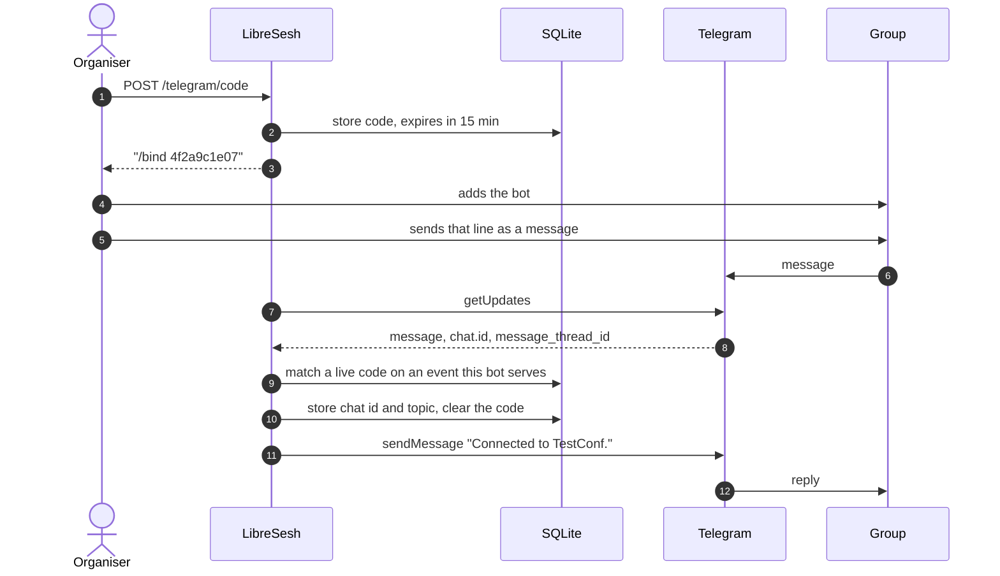
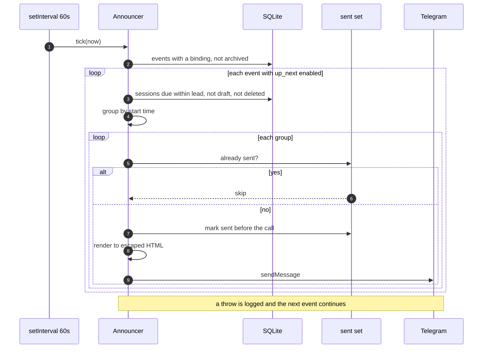

# Telegram announcements — software design specification

**Version:** 1.3 · **Status:** implemented · **Team:** LibreSesh

## Contents

- [1. Introduction](#1-introduction)
  - [1.1 Purpose](#11-purpose)
  - [1.2 Scope](#12-scope)
  - [1.3 Referenced documents](#13-referenced-documents)
  - [1.4 Definitions](#14-definitions)
- [2. System overview](#2-system-overview)
  - [2.1 Operating context](#21-operating-context)
  - [2.2 Use cases](#22-use-cases)
- [3. Architecture](#3-architecture)
  - [3.1 Overview](#31-overview)
  - [3.2 Design rationale](#32-design-rationale)
- [4. Module design](#4-module-design)
  - [4.1 Renderer](#41-renderer)
  - [4.2 Announcer](#42-announcer)
  - [4.3 Poller and command handler](#43-poller-and-command-handler)
  - [4.4 Poller pool](#44-poller-pool)
  - [4.5 HTTP routes](#45-http-routes)
- [5. Data design](#5-data-design)
- [6. Interface definitions](#6-interface-definitions)
  - [6.1 Internal interfaces](#61-internal-interfaces)
  - [6.2 External interface: Telegram Bot API](#62-external-interface-telegram-bot-api)
- [7. Non-functional constraints](#7-non-functional-constraints)
- [8. User interface design](#8-user-interface-design)
- [9. Traceability](#9-traceability)
- [10. Out of scope](#10-out-of-scope)
- [11. Open questions](#11-open-questions)
- [12. Revision history](#12-revision-history)

---

## 1. Introduction

### 1.1 Purpose

This document specifies the Telegram transport for LibreSesh announcements: how
an event is connected to a Telegram group, how announcements are rendered and
delivered, and what an organiser can configure.

### 1.2 Scope

**In scope:** the bot credential, group binding, in-group commands, message
rendering, delivery, and the Manage Event interface.

**Out of scope:** what an announcement *is*, which triggers exist, when one is
due, and what must never be announced. Those rules are transport-neutral and
are specified in [`announcements.md`](announcements.md); this transport implements them and does
not restate them. Nostr is specified in [`nostr-publishing.md`](nostr-publishing.md).

### 1.3 Referenced documents

| Document | Relevance |
| --- | --- |
| [`_planning/specs/announcements.md`](announcements.md) | The transport-neutral rules this implements |
| [`ARCHITECTURE.md`](../../ARCHITECTURE.md) §Telegram | Where this sits in the system |
| [`ARCHITECTURE.md`](../../ARCHITECTURE.md) §Notifications | The per-person inbox this is deliberately not |
| [`SECURITY.md`](../../SECURITY.md) §What a connected Telegram group sees | Disclosure and credentials |
| [`docs/managing.md`](../../docs/managing.md) §Telegram | Organiser-facing instructions |
| [Telegram Bot API](https://core.telegram.org/bots/api) | The external interface |

### 1.4 Definitions

| Term | Meaning |
| --- | --- |
| **Bot** | A Telegram account addressed by a token. Not a program: Telegram hosts no code and runs no scheduler on its behalf |
| **Bot token** | The credential that authorises acting as a bot. Format `<digits>:<secret>` |
| **Group** | A Telegram supergroup. Distinct from a *channel*, which is broadcast-only |
| **Binding** | The stored association between an event and one group |
| **Bind code** | A single-use, short-lived code that establishes a binding |
| **Transport** | A delivery mechanism for announcements. Telegram is one |
| **Slot** | All non-draft sessions of one event sharing a start time |
| **Lead** | Minutes before a slot's start at which it is announced |
| **Preset** | A named trigger set offered in the panel. A trigger set matching none is *custom* |

---

## 2. System overview

### 2.1 Operating context

An event's schedule is readable only behind an event password. This transport
gives an organiser the option of announcing part of it into a Telegram group
they control: what is starting next, the day's programme each morning, and a
session as it is added or moved. The triggers themselves are defined in
[`announcements.md`](announcements.md); this document is how Telegram renders
and delivers them.

All logic executes inside the LibreSesh server process. There is no separate
service, no code deployed to Telegram, and no scheduling facility on Telegram's
side. Outbound traffic is HTTPS to `api.telegram.org`; inbound is a long-poll
the process itself opens.

The destination is a **group**, not a broadcast channel. Five consequences
follow, and most of this design derives from them:

| | Channel | Group |
| --- | --- | --- |
| Who may post | Admins only | Any member, so the bot needs no admin rights |
| Addressing | Public `@name` | Numeric id an organiser cannot look up, so it must be discovered |
| Member messages | Not possible | Possible, so commands exist |
| Bot's view of traffic | N/A | Privacy mode: only messages addressed to it |
| Noise tolerance | A feed; a post costs little | A conversation; each post displaces it |

### 2.2 Use cases

| ID | Actor | Need |
| --- | --- | --- |
| **U1** | Organiser | Turn announcements on without becoming the town crier, and off again instantly when the room complains |
| **U2** | Attendee in the venue | One push shortly before each slot; not forty a day, which earns a permanent mute |
| **U3** | Single-track attendee | A group scoped to the rooms they care about |
| **U4** | Attendee reading at breakfast | The whole day in one message, and nothing further until tomorrow |
| **U5** | Attendee at an unconference | To hear about a session placed at short notice, which no printed programme can carry |
| **U6** | Remote follower | Links, including any livestream |
| **U7** | Instance operator | To enable the capability once, or not at all, without becoming a gatekeeper for each event |

U5 is the case that justifies the feature; U4 is already served by a printed
programme.

---

## 3. Architecture

### 3.1 Overview

```
LibreSesh server process
┌────────────────────────────────────────────┐
│ setInterval(60s) ── Announcer.tick()       │──► sendMessage ──► Telegram ──► group
│                       │ reads SQLite       │
│                       └─ Renderer          │
│ PollerPool ── Poller(token) ───────────────│◄── getUpdates  ◄── Telegram ◄── /bind
│ Express routes /api/e/:slug/telegram       │
└────────────────────────────────────────────┘
```

| Component | Responsibility | File |
| --- | --- | --- |
| Renderer | Announcement value → Telegram HTML, split to fit | `server/src/telegram.ts` |
| Announcer | Decides what is due; marks and sends | `server/src/telegram.ts` |
| Poller | One bot's inbound connection and commands | `server/src/telegram.ts` |
| PollerPool | One poller per distinct token, reconciled | `server/src/telegram.ts` |
| Routes | Configuration, bind codes, test message | `server/src/routes/telegram.ts` |
| Panel | Manage Event → Publish → Telegram | `web/src/pages/AdminTelegram.tsx` |
| Preview | The Example modal | `web/src/components/TelegramPreview.tsx` |

**Binding a group.** The only inbound flow, and the reason the poller exists.



**Announcing a slot.** The outbound flow, once a minute.



### 3.2 Design rationale

| Decision | Alternative | Why |
| --- | --- | --- |
| Logic in the app process | A separate announcer service | Needs its own host, deploy and credentials to read a gated event; the module is ~400 lines |
| `getUpdates` long-poll | Webhook | No public URL, no secret route, one code path in dev and production. Inbound volume is a handful of commands a day |
| Group discovered via bind code | Organiser pastes a chat id | A private group's id cannot be obtained without a third-party bot |
| Bot token per event | Instance-wide only | Organisers run their own events; a shared bot makes the operator a gatekeeper and puts their name on every message |
| One message per slot | One per session | A twelve-room slot would be twelve notifications (U2) |
| A line a session, two when streamed | Room, title, speakers and streams on lines of their own | A five-room slot ran to twenty lines. One notification is only one notification if it can be read at a glance |
| `placed` separate from `added` | One trigger for both | Building a programme is twenty sessions in an afternoon; a pitch landing mid-conference is the case the feature exists for (U5). One trigger cannot serve both |
| Every preset names a trigger that fires | A ladder that anticipates unbuilt triggers | "Light — one message each morning" sent nothing for as long as `digest` was unwritten. §8's own rule: never a control that cannot work |
| Light is `up_next`, not `digest` | The digest at the bottom | [`announcements.md`](announcements.md) fixes only that Medium carries the digest. Putting the per-slot message lowest makes migration 023's stored default a named preset, so no event opens its panel on "custom" |
| `changed` is buffered to the next tick | Sent from the route like `added` | A reshuffle is a dozen writes and one piece of news. The 60s tick already *is* the coalescing window |
| `added` inside the lead window sends the whole slot | Send the one session, then the slot | Two messages seconds apart saying nearly the same thing. Sending the slot and marking it keeps the rooms already in it visible |
| Livestream links a setting of their own | Part of a preset, or always on | A preset is a *noise* choice; this is a *disclosure* choice. A session link meets the password gate and a stream address does not, so it is not something to acquire by picking a volume |
| HTML parse mode | MarkdownV2 | Every interpolated value is user-authored; MarkdownV2 needs 18 characters escaped in each, and one miss is a 400 or mangled output |

---

## 4. Module design

### 4.1 Renderer

**Purpose.** Convert a slot into Telegram messages. Pure; no I/O.

**Processing.** `renderUpNext(startsAt, timeZone, items, sessionUrl, streams)`
emits a header followed by one block per session. A block is **one line, or two
when the session is streamed**: `Title, by Ada Lovelace`, then `Stream: Main
camera, Interpreted` — every stream on the one line — when `streams` is set.
Four lines a session made a five-room slot a message nobody reads to the
bottom; the slot is the unit that matters, and it has to be scannable in the
second it is on screen. Times
are formatted in the **event's** timezone via `zonedParts`. Every interpolated
value passes through `escapeHtml`, which escapes `&`, `<`, `>` and nothing
else. Accumulated length is checked per block against the 4096-character limit;
overflow starts a continuation message, always at a session boundary.

**Interfaces.** In: `AnnounceItem[]` (`id`, `title`, `room`, `speakers`,
`livestreams`) plus a URL function returning `null` when the instance has no
configured public address, and the event's livestream choice. Out: `string[]`,
one per message.

### 4.2 Announcer

**Purpose.** Decide which slots are due and deliver them.

**Processing.** Per tick, for each event with a binding and `archived = 0`,
each enabled trigger in turn — `changed` first, so a session dragged into the
next quarter of an hour reads as moved rather than arriving as a fresh slot,
then `digest`, then `up_next`. For `up_next`:

1. `dueSessions` selects `starts_at > now AND starts_at <= now + lead`, with
   `draft = 0` and `deleted_at IS NULL`.
2. `groupByStart` groups the result by start time.
3. A group already in the in-memory sent set is skipped.
4. Otherwise the group is **marked, then sent**.

Rationale for the range, the mark ordering, and the in-memory record is in
[`announcements.md`](announcements.md) §The loop. A failure for one event is logged and does not
stop the others.

The digest fires once per local day, inside a one-hour window after
`telegram_digest_min`, so a process restarted at 14:00 does not open by
announcing a day half over. `added` is called from the session routes beside
their `audit()`; `changed` is buffered by `noteMoved` and drained by the next
tick. Neither can fail a write — `announceQuietly` detaches the promise.

**Data structures.** `Set<string>` keyed `telegram:<eventId>:<startsAt>`, and
`telegram:digest:<eventId>:<localDate>` for the digest. The transport prefix is
required by [`announcements.md`](announcements.md) so one transport cannot
silence another. A second `Set<number>` holds the sessions actually announced:
`changed` fires only for those, because the move of a session the group was
never told about would disclose it.

**Interfaces.** Constructed with the database, the instance fallback token, the
public URL and a `Sender`. `nextSlotText` serves the `/next` command.

### 4.3 Poller and command handler

**Purpose.** Hold one bot's inbound connection and answer its commands.

**Processing.** `getUpdates` with `allowed_updates: ['message']` and a 25-second
timeout, tracking `offset`. On failure, exponential backoff from 5s to a 60s
ceiling, logging the first three attempts and then every twentieth.

`parseCommand` strips the `@BotName` suffix Telegram appends when more than one
bot is present.

| Command | Effect |
| --- | --- |
| `/bind <code>` | Binds the originating chat, and its topic, to the event holding a live code. Clears the code |
| `/unbind` | Clears the binding |
| `/next` | Replies with the next slot |

**Scoping.** Every command resolves against `servedEvents()` — events whose
effective token is this poller's, excluding archived events. Without it, one
organiser's bot could redeem another event's code or answer about an event it
has no relationship to.

**Interfaces.** Constructed with the database, its token, the fallback token,
an `Announcer` and a `Sender`.

### 4.4 Poller pool

**Purpose.** Keep one poller per distinct token in step with the database.

**Processing.** `reconcile()` computes the active token set (each event's own
token, or the instance's, excluding archived events), stops pollers whose token
has gone and starts pollers for tokens that have appeared. Called on each tick,
so a token saved through the UI is listening within a minute. Stopping does not
abort an in-flight request; that connection closes when Telegram answers it and
its result is ignored.

### 4.5 HTTP routes

All require the `admin` role and the `write` rate-limit bucket, and write an
`audit` row. Bodies are validated with `telegramSettingsSchema` before any
write, so a rejected field cannot leave a partial change behind.

| Route | Effect |
| --- | --- |
| `GET /telegram` | Status; never the token |
| `PATCH /telegram` | `mode`, `leadMin`, `botToken`, `livestreams`. Setting or clearing a token also clears the binding |
| `POST /telegram/code` | Mints a bind code, valid 15 minutes |
| `DELETE /telegram` | Clears the binding; keeps the token |
| `POST /telegram/test` | Sends a test message; returns Telegram's error text verbatim on failure |

---

## 5. Data design

Migration `023_telegram.sql` adds to `events`:

| Column | Type | Notes |
| --- | --- | --- |
| `telegram_bot_token` | TEXT null | This event's bot. Null falls back to `TELEGRAM_BOT_TOKEN` |
| `telegram_chat_id` | TEXT null | TEXT because a supergroup id is a large negative number |
| `telegram_topic_id` | INTEGER null | Captured at bind time; null for a group without topics |
| `telegram_triggers` | TEXT | JSON array. Modes are derived by matching, never stored |
| `telegram_lead_min` | INTEGER | Default 15 |
| `telegram_bind_code` | TEXT null | Unique where not null |
| `telegram_bind_expires` | TEXT null | ISO-8601 |
| `telegram_livestreams` | INTEGER | Migration 024. Default 0 — a disclosure choice is never on by default |
| `telegram_digest_min` | INTEGER | Migration 025. Local minute of day, default 480 (08:00 at the venue) |

**Constraints.** None of these columns appear in an export — the export writes
an explicit allow-list — so a cloned event cannot post into the original's
group. `telegram_bot_token` is never included in any DTO.

---

## 6. Interface definitions

### 6.1 Internal interfaces

```ts
type Sender = (token: string, message: TelegramMessage) => Promise<void>;

interface TelegramMessage {
  chatId: string;
  text: string;          // Telegram HTML
  topicId?: number | null;
  silent?: boolean;
}
```

`Sender` is injected into `Announcer`, `Poller` and `PollerPool` so that every
decision about *whether* to send is testable without a network.

### 6.2 External interface: Telegram Bot API

| Method | Use | Notes |
| --- | --- | --- |
| `sendMessage` | All outbound | `parse_mode: HTML`, previews disabled |
| `getUpdates` | All inbound | Only one consumer may hold a token; a second receives 409 |

Every call carries `AbortSignal.timeout(10_000)`.

---

## 7. Non-functional constraints

| Constraint | Design | Rationale |
| --- | --- | --- |
| A stalled Telegram must not affect the schedule | 10s abort on every call; the tick is wrapped in try/catch | The app serving the schedule is the priority |
| Message size ≤ 4096 characters | Split at a session boundary | A rejected message loses the whole slot |
| ≤ ~20 messages/minute per chat | One message per slot | Well inside the limit for any realistic event |
| One consumer per token | One bot per instance, documented in both env examples | A shared token means two pollers losing each other's commands |
| A misconfigured bot must not flood the log | Backoff to 60s; log 1–3 then every 20th | A per-minute error for three days trains operators to ignore logs |
| Token confidentiality | Never in a DTO, never in an export; only the last four characters are returned | It authorises posting as that bot anywhere it is a member |
| Disclosure | Publication warning in the panel itself; [`SECURITY.md`](../../SECURITY.md) records what a group sees | Connecting a group publishes part of a gated schedule |

---

## 8. User interface design

**Location.** Manage Event → **Publish** → Telegram. Publish is its own tab
because where the schedule goes outside this app is a distinct job, and further
transports join it rather than lengthening Settings.

**Controls.**

| Control | Behaviour |
| --- | --- |
| Bot | Token field with a **Save bot** action; once saved, shows the last four characters and **Remove**. An ⓘ explains what a bot is and links to [`docs/managing.md`](../../docs/managing.md) |
| Group | **Generate a code**, then the line to send in the group; when bound, **Send a test message** and **Disconnect** |
| How much it says | Select over the presets: **Off**, **Light**, **Medium**, **Heavy** |
| When the morning message goes out | `TimeField`, shown only for the presets that send one |
| How early it says it | Number field, 1–180 minutes |
| Livestreams | Checkbox, off by default, stating in its hint that a stream address does not meet the password gate |
| Save | One action for the three options above, disabled until a value differs from what is stored |
| Example | Opens the preview |

**Rules.**

- The options and Example are available **before** a group is connected.
  Choosing how loud this will be, and seeing what that means, is how an
  organiser decides whether they want a group at all.
- The bot and group controls are actions and take effect on click. The options
  are a form with one Save, matching Breaks, Rooms and Settings.
- With no bot available anywhere, the panel offers the token field and nothing
  else — never a control that cannot work.
- **Example** renders the messages the settings *currently on screen* would
  send — not the stored ones — built from the event's own sessions, excluding
  drafts. It is how an organiser decides whether to press Save, so answering
  with what is already saved answers a question nobody asked. These are the
  only settings in the application whose effect cannot be observed from the
  screen that changes them.
- **The panel offers no preset it cannot honour**, and the Example draws no
  bubble without a trigger behind it. Both failed once: Light meant `digest`
  while the digest was unwritten, so the setting sent nothing and the Example
  drew a message that never arrives. A rung joins the ladder when its trigger
  does.

---

## 9. Traceability

| Need | Design element | Verification |
| --- | --- | --- |
| U1 | §4.5 routes; §8 panel | `telegram.test.ts` route suite; `adminTelegram.test.tsx` |
| U2 | §4.1 one message per slot | `telegram.test.ts` "puts every room of one start time in a single message" |
| U3 | Room scope — **not implemented**, see §11 | — |
| U4 | §4.2 digest | `telegram.test.ts` "goes out once a day, at the hour the event chose" |
| U5 | §4.2 range selection, and the `placed` trigger | `telegram.test.ts` "takes a session created inside its own window"; "announces a pitch as it reaches the grid" |
| U6 | §4.1 links, and the livestream setting | `telegram.test.ts` "links the title when the instance knows its own address"; "carries a livestream link only when the event asks for it" |
| U7 | §5 per-event token | `telegram.test.ts` "lets an organiser turn Telegram on with no help from the operator" |
| Drafts never announced | §4.2 selection predicate | `telegram.test.ts` "never takes a draft" |
| Token confidentiality | §4.5 status projection | `telegram.test.ts` "never sends the token back" |
| Command scoping | §4.3 `servedEvents` | `telegram.test.ts` "will not let one event's bot redeem another event's code" |
| Timezone correctness | §4.1 `zonedParts` | `telegram.test.ts` non-whole-hour offset case |

Requirements without a design element: U3 and U4 (§11).

---

## 10. Out of scope

| Excluded | Reason |
| --- | --- |
| Editing or deleting posted messages | The useful correction window is minutes; it costs a stored `message_id` per post |
| A pinned, continuously edited board | An edit sends no notification, so it serves U4 and not U2. A separate feature |
| Commands beyond `/bind`, `/unbind`, `/next` | No demand established |
| Personal direct messages | Requires binding a Telegram account to an identity, and overturns [`ARCHITECTURE.md`](../../ARCHITECTURE.md) §Notifications |
| Verbosity levels beyond the default | [`announcements.md`](announcements.md) permits a transport to support one level |

---

## 11. Open questions

| # | Question | Effect if answered yes |
| --- | --- | --- |
| 1 | Per-room groups instead of one scoped group (U3)? | Columns become a `telegram_channels` table |
| 2 | Supergroup topics as a configurable target? | One nullable column is already present |
| 3 | Should a slot that holds the floor say so? | `blocks_open_booking` is currently invisible here |
| 4 | Localisation | The application has no i18n layer; this inherits that gap |
| 5 | Should a livestream link be verbosity (`full`) rather than its own flag? | [`announcements.md`](announcements.md) puts it on the "how much" axis; it is kept separate here because it is a disclosure choice, and folding it into a verbosity level would hand it out with one |

---

## 12. Revision history

| Version | Date | Change |
| --- | --- | --- |
| 1.0 | 2026-09-16 | First implemented specification. Transport-neutral rules referenced from [`announcements.md`](announcements.md) rather than restated |
| 1.1 | 2026-09-16 | Review pass. Presets cut to the ones whose triggers are built; livestream links added as a setting of their own (migration 024); the Example reads the screen, not the store; a failed test message reports Telegram's own words |
| 1.2 | 2026-09-17 | `digest`, `added` and `changed` built, so the ladder is four rungs again. Migration 025 adds the digest hour; the announcer moves onto the request context, because two of the three are write-path triggers |
| 1.3 | 2026-09-17 | `placed` becomes its own trigger (migration 026). Placing a pitch announced nothing at all, which was the case the feature exists for |
