# Database schema

_Generated from the migrations by `npm run schema` — do not edit by hand._
_`tests/schemaDiagram.test.ts` fails when this page is behind the migrations._

Every deployment has this schema, demo or production: the tables are what
the files in `server/migrations` make, and only the rows differ. Read this
beside the Data model section of `ARCHITECTURE.md`, which says what each
table is for; this page says what it contains and what links to what.

Crow’s feet: `||` exactly one, `|o` zero or one (a nullable reference),
`o{` many. Each line is labelled with the referencing column. `PK` primary
key, `FK` foreign key, `UK` unique on its own; multi-column unique indexes
are listed under the table.

```mermaid
erDiagram
  audit {
    INTEGER id PK
    INTEGER identity_id FK "nullable"
    INTEGER event_id FK "nullable"
    TEXT action
    TEXT entity
    INTEGER entity_id "nullable"
    TEXT at
    TEXT batch "nullable"
  }
  breaks {
    INTEGER id PK
    INTEGER event_id FK
    TEXT label
    INTEGER start_min
    INTEGER end_min
    TEXT date "nullable"
    TEXT created_at
  }
  contributions {
    INTEGER id PK
    INTEGER session_id FK
    TEXT kind
    TEXT body
    TEXT url "nullable"
    INTEGER created_by FK
    TEXT created_at
    INTEGER hidden "default 0"
    TEXT deleted_at "nullable"
  }
  event_identities {
    INTEGER event_id PK, FK
    INTEGER identity_id PK, FK
    TEXT display_name
    TEXT claimed_at
  }
  event_permissions {
    INTEGER event_id PK, FK
    TEXT capability PK
    TEXT role PK
    INTEGER allowed
  }
  event_slugs {
    TEXT slug PK
    INTEGER event_id FK
    TEXT created_at
  }
  events {
    INTEGER id PK
    TEXT slug UK
    TEXT name
    TEXT timezone
    TEXT start_date
    TEXT end_date
    INTEGER day_start_min "default 480"
    INTEGER day_end_min "default 1320"
    TEXT viewer_pw_hash
    TEXT user_pw_hash
    TEXT admin_pw_hash
    INTEGER archived "default 0"
    TEXT created_at
    TEXT user_role_label "default 'attendee'"
    INTEGER week_rail_from "default 8"
    INTEGER audit_keep "default 1000"
    TEXT default_view "default 'list'"
    INTEGER show_official_badge "default 0"
    INTEGER pitches_enabled "default 1"
  }
  identities {
    INTEGER id PK
    TEXT public_id UK
    TEXT token UK
    TEXT display_name
    TEXT created_at
    TEXT ics_token "nullable"
    TEXT last_seen_at "nullable"
  }
  link_codes {
    INTEGER id PK
    INTEGER identity_id FK
    INTEGER person_id FK "nullable"
    TEXT code_hash UK
    TEXT created_at
    TEXT expires_at "nullable"
    TEXT used_at "nullable"
  }
  migrations {
    TEXT name PK
    TEXT applied_at
  }
  notification_mutes {
    INTEGER event_id PK, FK
    INTEGER identity_id PK, FK
    TEXT kind PK
    TEXT muted_at
  }
  notifications {
    INTEGER id PK
    INTEGER event_id FK
    INTEGER identity_id FK
    TEXT kind
    TEXT subject_type
    INTEGER subject_id
    TEXT title
    TEXT body "default ''"
    INTEGER actor_id FK "nullable"
    TEXT created_at
    TEXT read_at "nullable"
  }
  people {
    INTEGER id PK
    INTEGER event_id FK
    INTEGER identity_id FK "nullable"
    TEXT name
    TEXT bio "default ''"
    TEXT links "default '[]'"
    TEXT created_at
    TEXT updated_at
    TEXT deleted_at "nullable"
    TEXT archived_at "nullable"
  }
  profile_claims {
    INTEGER id PK
    INTEGER event_id FK
    INTEGER person_id FK
    INTEGER identity_id FK
    TEXT requested_at
    TEXT declined_at "nullable"
  }
  proposal_interest {
    INTEGER identity_id PK, FK
    INTEGER proposal_id PK, FK
    TEXT created_at
  }
  proposal_tags {
    INTEGER proposal_id PK, FK
    INTEGER tag_id PK, FK
  }
  proposals {
    INTEGER id PK
    INTEGER event_id FK
    TEXT title
    TEXT description "default ''"
    INTEGER speaker_id FK "nullable"
    INTEGER created_by FK
    INTEGER placed_session_id FK "nullable"
    TEXT created_at
    TEXT updated_at
    TEXT deleted_at "nullable"
  }
  roles {
    INTEGER identity_id PK, FK
    INTEGER event_id PK, FK
    TEXT role
    TEXT granted_at
  }
  rooms {
    INTEGER id PK
    INTEGER event_id FK
    TEXT name
    TEXT description "default ''"
    INTEGER capacity "nullable"
    INTEGER open_booking "default 0"
    INTEGER sort_order "default 0"
    TEXT deleted_at "nullable"
    TEXT color "default '#BFD7E8'"
  }
  session_formats {
    INTEGER id PK
    INTEGER event_id FK
    TEXT name
    TEXT color "default '#6B7280'"
    INTEGER sort_order "default 0"
    TEXT deleted_at "nullable"
  }
  session_speakers {
    INTEGER session_id PK, FK
    INTEGER person_id PK, FK
    INTEGER sort_order "default 0"
  }
  session_tags {
    INTEGER session_id PK, FK
    INTEGER tag_id PK, FK
  }
  sessions {
    INTEGER id PK
    INTEGER event_id FK
    INTEGER room_id FK
    TEXT type
    TEXT title
    TEXT description "default ''"
    TEXT speaker "default ''"
    TEXT starts_at
    TEXT ends_at
    INTEGER created_by FK
    TEXT created_at
    TEXT updated_at
    TEXT deleted_at "nullable"
    INTEGER track_id FK "nullable"
    INTEGER blocks_open_booking "default 0"
    TEXT livestreams "default '[]'"
    INTEGER format_id FK "nullable"
    TEXT series_id "nullable"
  }
  stars {
    INTEGER identity_id PK, FK
    INTEGER session_id PK, FK
    TEXT created_at
  }
  tags {
    INTEGER id PK
    INTEGER event_id FK
    TEXT name
    TEXT color "default '#6B7280'"
    TEXT deleted_at "nullable"
  }
  track_windows {
    INTEGER id PK
    INTEGER track_id FK
    TEXT date
    INTEGER start_min
    INTEGER end_min
    TEXT created_at
  }
  tracks {
    INTEGER id PK
    INTEGER event_id FK
    TEXT name
    TEXT color
    INTEGER sort_order "default 0"
    TEXT deleted_at "nullable"
    INTEGER start_min "nullable"
    INTEGER end_min "nullable"
    TEXT description "default ''"
  }
  events |o--o{ audit : event_id
  identities |o--o{ audit : identity_id
  events ||--o{ breaks : event_id
  identities ||--o{ contributions : created_by
  sessions ||--o{ contributions : session_id
  events ||--o{ event_identities : event_id
  identities ||--o{ event_identities : identity_id
  events ||--o{ event_permissions : event_id
  events ||--o{ event_slugs : event_id
  identities ||--o{ link_codes : identity_id
  people |o--o{ link_codes : person_id
  events ||--o{ notification_mutes : event_id
  identities ||--o{ notification_mutes : identity_id
  identities |o--o{ notifications : actor_id
  events ||--o{ notifications : event_id
  identities ||--o{ notifications : identity_id
  events ||--o{ people : event_id
  identities |o--o{ people : identity_id
  events ||--o{ profile_claims : event_id
  identities ||--o{ profile_claims : identity_id
  people ||--o{ profile_claims : person_id
  identities ||--o{ proposal_interest : identity_id
  proposals ||--o{ proposal_interest : proposal_id
  proposals ||--o{ proposal_tags : proposal_id
  tags ||--o{ proposal_tags : tag_id
  identities ||--o{ proposals : created_by
  events ||--o{ proposals : event_id
  sessions |o--o{ proposals : placed_session_id
  people |o--o{ proposals : speaker_id
  events ||--o{ roles : event_id
  identities ||--o{ roles : identity_id
  events ||--o{ rooms : event_id
  events ||--o{ session_formats : event_id
  people ||--o{ session_speakers : person_id
  sessions ||--o{ session_speakers : session_id
  sessions ||--o{ session_tags : session_id
  tags ||--o{ session_tags : tag_id
  identities ||--o{ sessions : created_by
  events ||--o{ sessions : event_id
  session_formats |o--o{ sessions : format_id
  rooms ||--o{ sessions : room_id
  tracks |o--o{ sessions : track_id
  identities ||--o{ stars : identity_id
  sessions ||--o{ stars : session_id
  events ||--o{ tags : event_id
  tracks ||--o{ track_windows : track_id
  events ||--o{ tracks : event_id
```

## Tables
### `audit`

- **References:** `event_id` → [`events`](#events).`id`, `identity_id` → [`identities`](#identities).`id`
- **Referenced by:** nothing
- **Primary key:** `id`

### `breaks`

- **References:** `event_id` → [`events`](#events).`id`
- **Referenced by:** nothing
- **Primary key:** `id`

### `contributions`

- **References:** `created_by` → [`identities`](#identities).`id`, `session_id` → [`sessions`](#sessions).`id`
- **Referenced by:** nothing
- **Primary key:** `id`

### `event_identities`

- **References:** `event_id` → [`events`](#events).`id`, `identity_id` → [`identities`](#identities).`id`
- **Referenced by:** nothing
- **Primary key:** `event_id`, `identity_id`
- **Unique:** `event_id` + `display_name`

### `event_permissions`

- **References:** `event_id` → [`events`](#events).`id`
- **Referenced by:** nothing
- **Primary key:** `event_id`, `capability`, `role`

### `event_slugs`

- **References:** `event_id` → [`events`](#events).`id`
- **Referenced by:** nothing
- **Primary key:** `slug`

### `events`

- **References:** nothing
- **Referenced by:** [`audit`](#audit).`event_id`, [`breaks`](#breaks).`event_id`, [`event_identities`](#event_identities).`event_id`, [`event_permissions`](#event_permissions).`event_id`, [`event_slugs`](#event_slugs).`event_id`, [`notification_mutes`](#notification_mutes).`event_id`, [`notifications`](#notifications).`event_id`, [`people`](#people).`event_id`, [`profile_claims`](#profile_claims).`event_id`, [`proposals`](#proposals).`event_id`, [`roles`](#roles).`event_id`, [`rooms`](#rooms).`event_id`, [`session_formats`](#session_formats).`event_id`, [`sessions`](#sessions).`event_id`, [`tags`](#tags).`event_id`, [`tracks`](#tracks).`event_id`
- **Primary key:** `id`
- **Unique:** `slug`

### `identities`

- **References:** nothing
- **Referenced by:** [`audit`](#audit).`identity_id`, [`contributions`](#contributions).`created_by`, [`event_identities`](#event_identities).`identity_id`, [`link_codes`](#link_codes).`identity_id`, [`notification_mutes`](#notification_mutes).`identity_id`, [`notifications`](#notifications).`actor_id`, [`notifications`](#notifications).`identity_id`, [`people`](#people).`identity_id`, [`profile_claims`](#profile_claims).`identity_id`, [`proposal_interest`](#proposal_interest).`identity_id`, [`proposals`](#proposals).`created_by`, [`roles`](#roles).`identity_id`, [`sessions`](#sessions).`created_by`, [`stars`](#stars).`identity_id`
- **Primary key:** `id`
- **Unique:** `ics_token` (partial — see the migration for the condition); `public_id`; `token`

### `link_codes`

- **References:** `identity_id` → [`identities`](#identities).`id`, `person_id` → [`people`](#people).`id`
- **Referenced by:** nothing
- **Primary key:** `id`
- **Unique:** `code_hash`; `person_id` (partial — see the migration for the condition)

### `migrations`

- **References:** nothing
- **Referenced by:** nothing
- **Primary key:** `name`

### `notification_mutes`

- **References:** `event_id` → [`events`](#events).`id`, `identity_id` → [`identities`](#identities).`id`
- **Referenced by:** nothing
- **Primary key:** `event_id`, `identity_id`, `kind`

### `notifications`

- **References:** `actor_id` → [`identities`](#identities).`id`, `event_id` → [`events`](#events).`id`, `identity_id` → [`identities`](#identities).`id`
- **Referenced by:** nothing
- **Primary key:** `id`

### `people`

- **References:** `event_id` → [`events`](#events).`id`, `identity_id` → [`identities`](#identities).`id`
- **Referenced by:** [`link_codes`](#link_codes).`person_id`, [`profile_claims`](#profile_claims).`person_id`, [`proposals`](#proposals).`speaker_id`, [`session_speakers`](#session_speakers).`person_id`
- **Primary key:** `id`
- **Unique:** `event_id` + `identity_id` (partial — see the migration for the condition)

### `profile_claims`

- **References:** `event_id` → [`events`](#events).`id`, `identity_id` → [`identities`](#identities).`id`, `person_id` → [`people`](#people).`id`
- **Referenced by:** nothing
- **Primary key:** `id`
- **Unique:** `event_id` + `identity_id` (partial — see the migration for the condition)

### `proposal_interest`

- **References:** `identity_id` → [`identities`](#identities).`id`, `proposal_id` → [`proposals`](#proposals).`id`
- **Referenced by:** nothing
- **Primary key:** `identity_id`, `proposal_id`

### `proposal_tags`

- **References:** `proposal_id` → [`proposals`](#proposals).`id`, `tag_id` → [`tags`](#tags).`id`
- **Referenced by:** nothing
- **Primary key:** `proposal_id`, `tag_id`

### `proposals`

- **References:** `created_by` → [`identities`](#identities).`id`, `event_id` → [`events`](#events).`id`, `placed_session_id` → [`sessions`](#sessions).`id`, `speaker_id` → [`people`](#people).`id`
- **Referenced by:** [`proposal_interest`](#proposal_interest).`proposal_id`, [`proposal_tags`](#proposal_tags).`proposal_id`
- **Primary key:** `id`

### `roles`

- **References:** `event_id` → [`events`](#events).`id`, `identity_id` → [`identities`](#identities).`id`
- **Referenced by:** nothing
- **Primary key:** `identity_id`, `event_id`

### `rooms`

- **References:** `event_id` → [`events`](#events).`id`
- **Referenced by:** [`sessions`](#sessions).`room_id`
- **Primary key:** `id`

### `session_formats`

- **References:** `event_id` → [`events`](#events).`id`
- **Referenced by:** [`sessions`](#sessions).`format_id`
- **Primary key:** `id`
- **Unique:** `event_id` + `name`

### `session_speakers`

- **References:** `person_id` → [`people`](#people).`id`, `session_id` → [`sessions`](#sessions).`id`
- **Referenced by:** nothing
- **Primary key:** `session_id`, `person_id`

### `session_tags`

- **References:** `session_id` → [`sessions`](#sessions).`id`, `tag_id` → [`tags`](#tags).`id`
- **Referenced by:** nothing
- **Primary key:** `session_id`, `tag_id`

### `sessions`

- **References:** `created_by` → [`identities`](#identities).`id`, `event_id` → [`events`](#events).`id`, `format_id` → [`session_formats`](#session_formats).`id`, `room_id` → [`rooms`](#rooms).`id`, `track_id` → [`tracks`](#tracks).`id`
- **Referenced by:** [`contributions`](#contributions).`session_id`, [`proposals`](#proposals).`placed_session_id`, [`session_speakers`](#session_speakers).`session_id`, [`session_tags`](#session_tags).`session_id`, [`stars`](#stars).`session_id`
- **Primary key:** `id`

### `stars`

- **References:** `identity_id` → [`identities`](#identities).`id`, `session_id` → [`sessions`](#sessions).`id`
- **Referenced by:** nothing
- **Primary key:** `identity_id`, `session_id`

### `tags`

- **References:** `event_id` → [`events`](#events).`id`
- **Referenced by:** [`proposal_tags`](#proposal_tags).`tag_id`, [`session_tags`](#session_tags).`tag_id`
- **Primary key:** `id`
- **Unique:** `event_id` + `name`

### `track_windows`

- **References:** `track_id` → [`tracks`](#tracks).`id`
- **Referenced by:** nothing
- **Primary key:** `id`
- **Unique:** `track_id` + `date`

### `tracks`

- **References:** `event_id` → [`events`](#events).`id`
- **Referenced by:** [`sessions`](#sessions).`track_id`, [`track_windows`](#track_windows).`track_id`
- **Primary key:** `id`
- **Unique:** `event_id` + `name`
